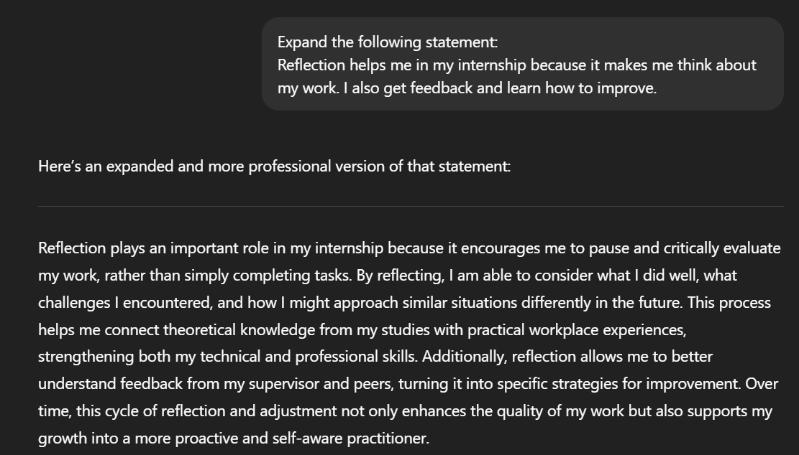

# AI Usage Guidelines

🔍 Research & Learn

1. What AI tools are typically used for your role?

I typically use ChatGPT to answer simple questions, write text, do simple coding
functions. I use Lovable.dev to create full projects and working applications
for personal use. I use CoPilot to help with coding projects like autofilling
sections that are obvious.

I have tried to use other AI but have been unsuccessful in making them work as
effectively as the 3 above.

1. What are the benefits and risks of using AI in a professional setting? For
   the purpose of this question i'll be using my position as a Mobile App
   Developer Intern.

- Benefits
  - Faster onboarding – AI-powered documentation or chatbots can help you
    quickly find company policies, code snippets, or app design guidelines.
  - Code assistance – AI tools (like GitHub Copilot) can suggest code, fix bugs,
    or help you learn new frameworks faster.
  - User feedback analysis – AI can process thousands of app reviews to spot
    common issues or feature requests.
  - Design inspiration – AI image generators or UI suggestion tools can speed up
    mockups and wireframes.
  - Testing and QA – AI-powered testing tools can detect bugs or performance
    issues more efficiently.

- Risks
  - Incorrect suggestions – AI-generated code might look right but contain
    hidden bugs or security flaws.
  - Data privacy – Using real customer data with AI tools could violate privacy
    laws if not anonymized.
  - Skill atrophy – Relying too much on AI for answers could slow development of
    independent problem-solving.
  - Bias in AI tools – Design suggestions or content generation might
    unintentionally exclude certain user groups.
  - Security vulnerabilities – AI-generated code could introduce exploitable
    weaknesses.

1. What types of information should never be entered into AI tools?

Referring to Data-Privacy-Reflection.md these data are what i would say should
never to accessible to AI:

- Personally Identifiable Information (PII)
- Full names linked with other personal details
- Home addresses, phone numbers, email addresses
- Government IDs (passport, driver’s license, tax ID)

- Confidential Company Data
  - Source code or proprietary algorithms not approved for public sharing
  - Internal business plans, financial statements, or strategy documents
  - API keys, server credentials, or encryption keys

- Customer/User Data
  - Login credentials, passwords, PINs
  - Customer support tickets containing private info
  - Payment information (credit card numbers, bank details)

- Legally Protected or Sensitive Info
  - Health data covered under laws like HIPAA
  - Legal case details
  - Trade secrets or patentable inventions

- Rule of thumb: If sharing it publicly would harm the company, breach privacy
  laws, or compromise security, don’t paste it into an AI tool unless the
  company explicitly approves it and it’s on a secure, internal AI system.

1. How can you fact-check and validate AI-generated content to ensure accuracy?

I would personally do the following:

- Cross-reference with credible sources
  - Check official websites, reputable news outlets, or peer-reviewed research.
  - For technical info, verify against trusted documentation.

- Check for recent updates
  - AI can produce outdated info make sure to confirm dates, version numbers,
    and current best practices.

- Verify data and statistics
  - Trace numbers back to their original source, not just blogs that repeat
    them.

- Test technical instructions
  - If AI gives code or steps, run them in a safe, test environment first. DO
    NOT RUN THEM IN THE CODE BASE.

- Watch for confident but wrong answers
  - Be skeptical of absolute statements without sources.

- Ask a human expert
  - When in doubt, confirm with a teammate, supervisor, or an expert on the
    matter.

📝 Reflection

1. When should you use AI for assistance, and when should you rely on your own
   skills?

You should use AI when:

- Brainstorming ideas (UI layouts, feature names, marketing copy drafts).
- Getting unstuck (explaining a programming concept, summarising documentation).
- Speeding up repetitive tasks (drafting outlines, creating placeholder text,
  generating test data).
- Learning new tools or frameworks (getting an overview before deeper research).

You shouldn't use AI when:

- Making final design or coding decisions that affect production.
- Handling sensitive data (never paste personal code, credentials, or customer
  info into AI tools).
- Following company policies or compliance rules (always check official guidance
  first).
- Evaluating accuracy-critical work (e.g., security settings, financial
  figures).

1. How can you avoid over-reliance on AI while still benefiting from it?

- Treat AI outputs as drafts, not final answers
  - Always review, fact-check, and refine what AI gives you.
  - Asking myself: “Does this align with my own knowledge and the project’s
    goals?”

- Keep practicing core skills
  - If AI writes code, i'd try to understand and replicate the logic myself.
  - If AI explains something, rewriting it in my own words to confirm that i've
    learned it.

- Set “AI boundaries”
  - Use AI for ideas, structure, and speed, but make final decisions myself.
  - Avoid feeding it confidential or sensitive information so you keep control
    over risk.

- Build a habit of independent problem-solving first
  - Try solving a problem on my own before asking AI, it strengthens technical
    skills.
  - Only turn to AI if you’re stuck or need a fresh perspective.

- Learn from the AI, not just use it
  - Treat every AI answer as a learning opportunity, ask why it made that
    choice.
  - Over time, you’ll need it less for basic tasks and more for creativity or
    efficiency.

1. What steps will you take to ensure data privacy when using AI tools?

- Know the privacy policy
  - Check the AI tool’s terms of service and data usage policy to see if it
    stores or uses my inputs.
  - Avoid tools that claim ownership of anything you submit unless explicitly
    approved by Focus bear.

- Never enter sensitive or confidential information
  - Never paste customer data, source code, financial records, internal
    documents, or proprietary designs into AI tools.
  - If you must reference sensitive content, replace details with generic
    placeholders.

- Use company-approved AI platforms
  - I would stick to AI tools that have been vetted and approved by Focus Bears
    IT/security team.

- Limit data exposure
  - Share only the minimum amount of context needed for AI to help.
  - If a small summary works instead of full raw data, use the summary.

- Keep devices and accounts secure
  - Enable two-factor authentication on AI tool accounts.
  - Keep software updated to patch security vulnerabilities.

- Follow company data handling policies
  - Focus Bear already have rules for data classification and storage.
  - Making sure my AI use aligns with those guidelines.

🛠️ Task

1. Identify one task you can improve using an AI tool, and try it out. I
   attempted to use Focus Bears most recent update on 17/07/2025, It simply said
   Fix Bugs and Improve UI/UX which in my opinion was too simple and lacking
   impact, after the AI had a look it converted it into a more impressionable
   description.

Whats New What’s New in This Update:

- Fix Bugs ---------------> - Squashed several bugs to make your app experience
  smoother and more reliable.

- Improve UI/UX - Enhanced the user interface and overall user experience for
  easier navigation and a fresher look.

1. Review the AI-generated output critically—did it require editing or
   fact-checking?

The AI Generated output in the case above improved the details of the updates
and this description would be better if i was able to know exactly what bug was
fixed and what exactly the improvements made on th UI/UX are but that would
require more information that i do not possess.

1. Document one best practice you will follow when using AI tools at Focus Bear.

I will make sure that i use AI in moderation to solve the more mundane and
repetitive task while trying to solve the actual issues myself and learning from
them.

For me, using AI in moderation means applying it only when it adds value, not as a shortcut to avoid thinking critically. Specifically:

- I use AI for structuring, rewording, and polishing content.
- I avoid using it when original analysis, decision-making, or personal reflection is required, since those need to come from my own judgment and experience.
- My rule of thumb: if the task is about expressing ideas clearly, I let AI assist. If the task is about generating ideas or making choices, I rely on my own reasoning first, then use AI only to refine.

1. Screenshots:
   
   I have begun using similar AI-supported workflows in other parts of my internship. For example, when drafting technical documentation, I use AI to improve clarity and tone so it’s more accessible for non-technical team members. In future work at Focus Bear, I can apply this workflow to polish stakeholder reports, generate user-friendly feature explanations, and create concise summaries of technical discussions. This ensures my communication is professional and efficient, without spending excessive time on wording.
