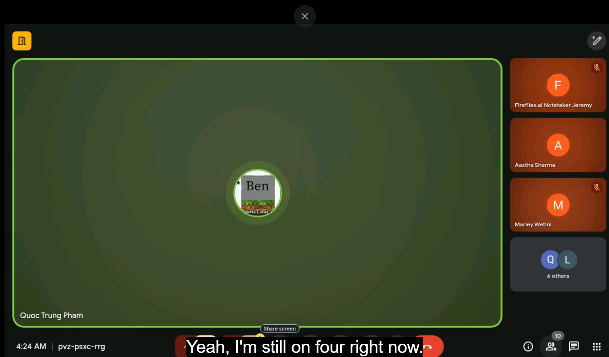

# Agile Ceremonies

1. What are the main Agile ceremonies, and what is their purpose?

- Daily Stand-ups
  - Short (usually 15-minute) daily meetings where each team member shares:
    - What they worked on yesterday
    - What they plan to work on today
    - Any blockers they are facing
  - Purpose: Keep everyone aligned, identify issues early, and promote
    accountability.
- So far as of 25/08/2025 I have attended a total of 6 Standup Meetings for
  the Mobile App development Team and will be attending my 7th today.
- A lot were discussed however the main things were everyone's weekly update of
  what they have been doing, for interns that was mostly doing the onboarding tsk.
  FOr Developers such as Bao, Ken and Mia they have been working on new features
  such as an AI Prompt to Routine feature and also an emoji picker feature for routines
  and breaks, Ken had been working on test for the Mobile App.

- Sprint Planning (Scrum) vs. Continuous Prioritization (Kanban)
  - Scrum is a meeting at the start of a sprint to decide what backlog items
    will be completed, the team discusses priorities, breaks tasks into
    manageable pieces, and estimates effort. In Kanban on the other hand instead
    of fixed planning, priorities are updated regularly as new tasks arrive,
    work is pulled into the workflow as capacity allows.

- Retrospectives
  - End-of-sprint (or periodic) meetings to reflect on what went well, what could be improved, and create concrete actions for improvement. Encourages continuous learning and process refinement.

- Backlog Refinement
  - Regular sessions to review and clarify backlog items, ensure they are
    well-defined, and re-prioritize if necessary, it helps the team stay ready
    for future work and prevents last-minute surprises.

1. How do Agile teams collaborate asynchronously and across time zones?

- Use project management tools (e.g., Jira, Trello) to track progress visually.
- Maintain updated documentation in shared spaces like Confluence or Notion.
- Record sprint demos or stand-ups for members who cannot attend live.
- Use asynchronous communication tools (Slack threads, comments in tickets) to
  discuss without requiring real-time meetings.
- Overlap working hours where possible for critical discussions.

1. How do Agile ceremonies help with communication and alignment?

- Agile ceremonies provide structured opportunities for the team to share
  progress, identify roadblocks, and make collective decisions, they ensure
  everyone has the same understanding of priorities and goals, even when working
  remotely or asynchronously.

1. Which ceremony do you think is most important for your role, and why?

- For a Mobile App Developer Intern, Daily Stand-ups are the most important
  because they keep me updated on what others are doing, help me quickly flag
  blockers, and give me a chance to align my work with ongoing tasks in
  real-time. Also gives me time to share my progress with the team.

1. Attend a stand-up meeting and observe how updates are shared.

I have attended several meetings so far and at Focus Bear there have been many
interesting topics discussed such as with the topic on user created routines and
many more i'm looking forward to hearing about and helping out.

1. Participate in a retrospective or review past notes from one.
   22/08/2025 - 14:15 Focus Bear scrum ceremonies mobile team
   The Most recent scrum meeting discussed the issues that have been resolved or
   are still ongoing such as updating the app to React Native version 1.9 which
   seems to have recently been completed and there had been discussions on the
   issues on the backend suffering from endpoint failures which requires urgent
   fixes. Some of the new features are now in the process of review before they
   go live concluding the end of sprint 5 and the start of sprint 6.

1. Document one change you can make to improve your team collaboration.

Since I am still in the onboarding phase, one change I can make to improve
collaboration is to proactively ask clarifying questions in our team chat when
I’m unsure about a task or process, rather than waiting until the next meeting.
This ensures I stay aligned with the team’s expectations, helps me learn faster,
and prevents delays in my work that could affect others.

1. Screenshot:
   
