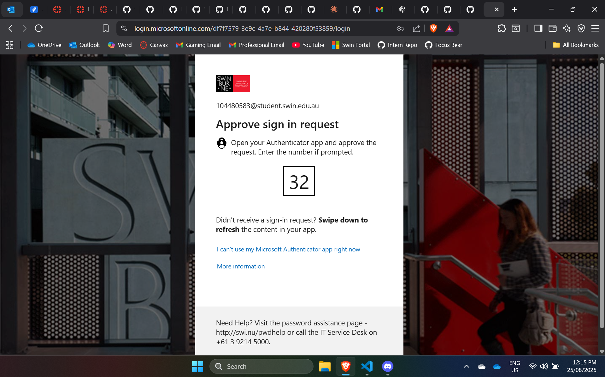
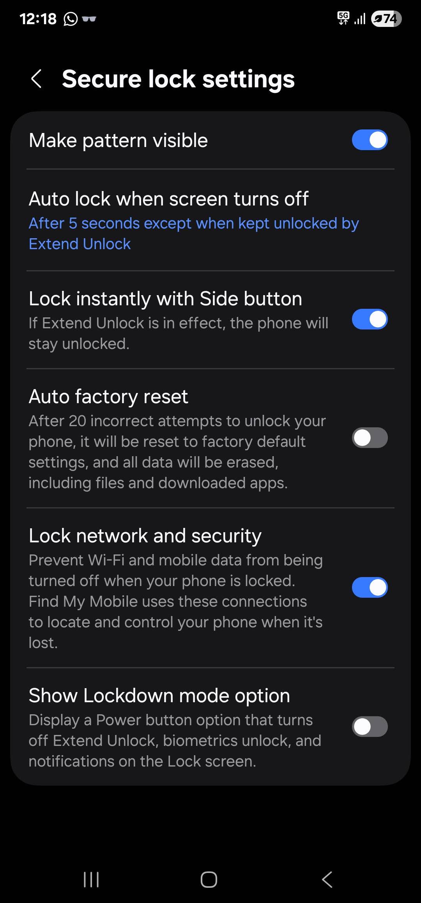
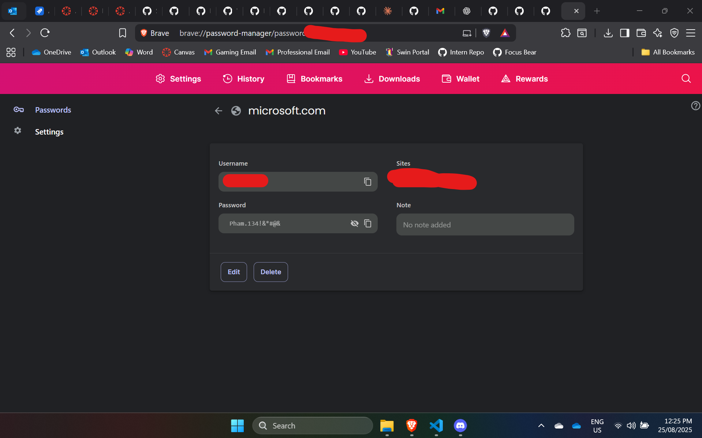

# Cyber Security Guidelines

🔍 Research & Learn

1. What are common cyber security threats in a remote work environment?

- Phishing attacks: deceptive emails or messages tricking employees into
  revealing credentials or downloading malware.
- Unsecured Wi-Fi networks: Using public or home networks without proper
  encryption can expose data to hackers.
- Weak passwords and lack of multi-factor authentication (MFA): Making accounts
  easier to compromise.
- Outdated software and unpatched vulnerabilities: Providing entry points for
  attackers.
- Use of personal devices: Which may lack corporate security controls.
- Data leakage: Accidental sharing or loss of sensitive information.
- Ransomware attacks: Malware that encrypts data and demands payment.
- Insider threats: Intentional or accidental actions by employees compromising
  security.

1. What are best practices for keeping your devices and accounts secure?

- Use strong, unique passwords for each account and update them regularly.
- Enable two-factor authentication (2FA) wherever possible.
- Keep my software and operating systems up to date with the latest security
  patches.
- Install and maintain reputable antivirus and anti-malware software.
- Avoid clicking on suspicious links or downloading attachments from unknown
  sources.
- Use secure Wi-Fi connections or VPNs, especially on public networks.
- Regularly backup important data to a secure location.
- Log out of accounts and lock devices when not in use.
- Limit app permissions and only install software from trusted sources.

1. Why is it important to lock your computer when away from your desk?

- Prevents unauthorized access to my files, emails, and sensitive information.
- Protects against accidental or intentional misuse of my account by others
  nearby.
- Helps maintain data privacy and security, especially in shared or public
  spaces.
- Reduces the risk of security breaches or data leaks caused by unattended,
  unlocked devices.
- Ensures compliance with workplace security policies and legal data protection
  requirements.

1. How should you handle phishing attempts and suspicious links?

- Do not click on links or download attachments from unknown or unexpected
  emails or messages.
- Verify the sender’s identity by checking the email address carefully or
  contacting the person/company directly using trusted contact details.
- Look out for red flags like spelling errors, urgent requests, or unfamiliar
  URLs.
- Report phishing attempts to the Focus Bear IT department or email provider.
- Use security software that can detect and block phishing sites.
- If you accidentally click a suspicious link, disconnect from the internet and
  notify the Focus Bear IT team immediately.
- Regularly update passwords and enable two-factor authentication to minimize
  damage if credentials are compromised.

1. What makes a strong password, and why should you use a password manager?

- A strong password is:
  - Long (at least 12 characters)
  - Includes a mix of uppercase and lowercase letters, numbers, and special
    characters
  - Unique: not reused across multiple sites
  - Unpredictable: avoids common words, phrases, or easily guessable info like
    birthdays

- Using a password manager helps because it:
  - Generates and stores complex, unique passwords for every account.
  - Saves you from remembering many passwords, reducing the temptation to reuse
    them
  - Automatically fills in passwords securely, protecting against keyloggers or
    phishing
  - Helps you update and manage passwords efficiently

1. Why is two-factor authentication (2FA) important, and when should you enable
   it?

- Two-factor authentication (2FA) is important because it adds an extra layer of
  security beyond just a password. Even if someone steals or guesses my
  password, they still need a second factor—like a code from my phone or a
  biometric check—to access my accounts. This greatly reduces the risk of
  unauthorized access.

- You should enable 2FA on all accounts that support it, especially for:
  - Email and social media
  - Online banking and financial services
  - Work-related accounts and VPNs
  - Cloud storage and collaboration tools

📝 Reflection

1. What security measures do you currently follow, and where can you improve?

I have 2FA on some of my more important platforms such as the student portals,
camera's, and Gmails. I have been slacking on the password part as i use
relatively similar ones on a lot of my platforms but i've been trying out new
and more unique passwords and working towards changing all the passwords for my
more important platforms.

1. How can you make secure behaviour a habit rather than an afterthought?

Just keeping in mind what could potentially be lost should i not keep stuff
consistent is most of the time enough for me but another way i can keep track of
it is to be make a little counter game where i'll uptick it when i implement a
security measure correctly.

1. What steps will you take to ensure your passwords and accounts are secure?

For better passwords i should just use a mix of unique characters such as @ or &
or ^ to improve the strength of the password cause i've been setting passwords
with the intention of it being easy to memorize which isn't the best way to
create passwords.

1. What would you do if you suspected a security breach or suspicious activity
   on your account?

- Changing my password immediately to a strong, unique one.
- Enable or verify two-factor authentication (2FA) if not already active.
- Review recent account activity for unauthorized actions or changes.
- Log out of all devices connected to the account, if the option is available.
- Notifying the Focus Bear IT department or service provider about the suspected
  breach.
- Running a full antivirus and malware scan on my devices to check for
  infections.
- Be cautious of further suspicious emails or messages—avoid clicking unknown
  links.
- Monitoring my account and related services closely for ongoing unusual
  behavior.

🛠️ Task

1. Ensure your work accounts have strong passwords and enable 2FA where
   possible.

1. Review your password storage method—if you’re not using a password manager,
   consider setting one up.

Luckily for me the browser that i use 'Brave' has an inbuilt password manager.

1. Set up your computer and phone to automatically lock (require a password or
   biometric login) if you are away for more than a few minutes

I have set my laptop screen to automatically lock itself after 5 minutes of
inactivity.

1. Document one new cyber security habit you will follow at Focus Bear.

I'll always make sure that my passwords contains at least 5 Uniques symbols and
a mix of Upper Case and Lower Case letters for better security.

1. Screenshots:
   
   I have 2 Factor Authentication on my Swinburne Student Account.

A screenshot from my mobile device.

A password using the previously stated password conditions.
