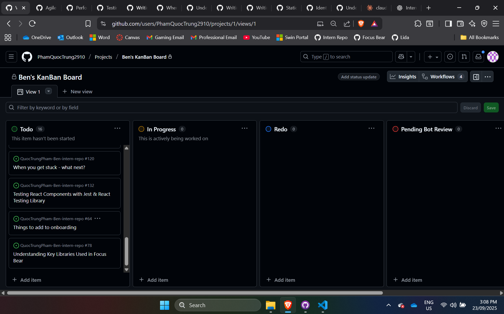
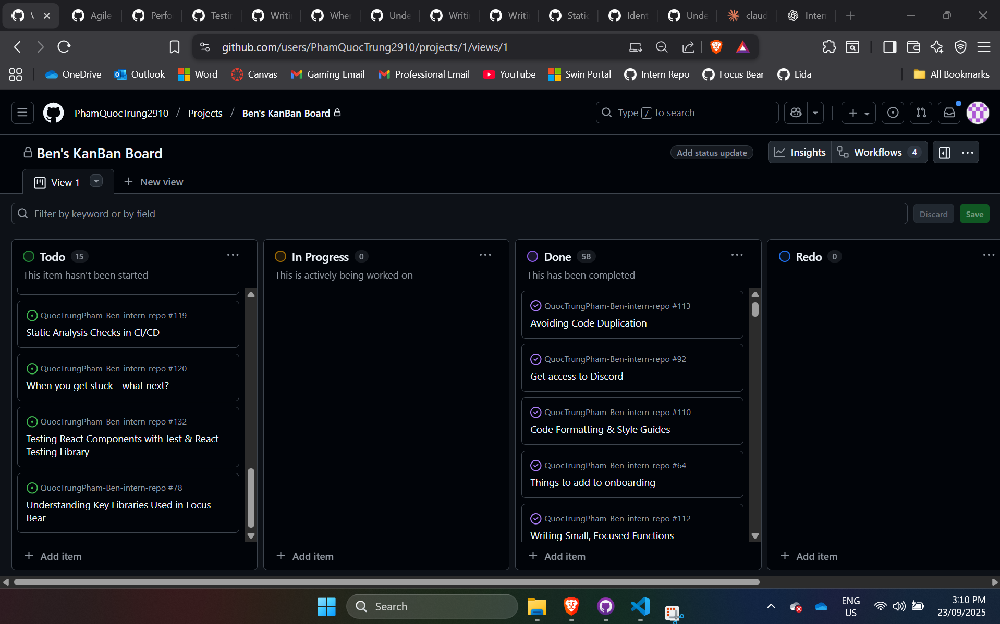

# Kanban Workflow

🔍 Research & Learn

1. How does a Kanban board work, and how does it help manage workflow?

- A Kanban board visually represents work items and their progress through
  different stages. Tasks are placed in columns (e.g., Backlog → In Progress →
  Done) and moved as work progresses. It helps manage workflow by making the
  status of every task visible, reducing confusion, and improving team
  coordination.

1. What do the different columns on a Kanban board represent? (e.g., Backlog, In
   Progress, Blocked, Done)

- Backlog: Tasks planned but not yet started.
- In Progress: Tasks currently being worked on.
- Blocked: Tasks that can’t move forward due to dependencies or issues.
- Done: Completed tasks that have met all requirements.

1. How do tasks move through the board, and who is responsible for updating
   them?

- Tasks move from left to right as work is started and completed. The person
  working on the task is usually responsible for updating its status, although
  in some teams the project manager also checks for accuracy.

1. What are the benefits of limiting work in progress (WIP)?

- Prevents task overload and context switching.
- Encourages completion of tasks before starting new ones.
- Improves focus and quality of work.
- Highlights bottlenecks early.

📝 Reflection

1. How does Kanban help manage priorities and avoid overload?

- Kanban keeps priorities visible and organized, ensuring that the most
  important tasks are worked on first. By limiting WIP, it stops the team from
  taking on too much at once, which reduces burnout and mistakes.

1. How can you improve your workflow using Kanban principles?

- I can set a personal WIP limit for my assigned tasks and update statuses daily
  so the team always has an accurate view of my progress.

🛠️ Task

1. Check out Focus Bear’s Kanban board and note how tasks are structured. (Hint:
   Look in GitHub Projects.)

- Tasks are organized into columns by workflow stage, with labels for priority
  and assigned team members.

1. Move at least one task through the Kanban process and update its status
   correctly.

- I accessed the Focus Bear Kanban board and practiced moving a task through the
  workflow. Specifically, I moved the card Things to add to onboarding from the
  To Do column directly to Done, as the items listed there had already been
  completed and verified against the onboarding documentation. This exercise
  helped me understand how to update task statuses in practice and reinforced
  how Kanban makes progress visible to the whole team. By moving the task
  myself, I confirmed that I have the necessary access to the board and can
  contribute to maintaining accurate task tracking.
  
  

1. Identify one way you can improve task tracking in your role.

Since I’m still in onboarding, I can improve task tracking by adding clear,
descriptive titles and due dates when creating new tasks, so they’re easier for
the whole team to understand and prioritize.
