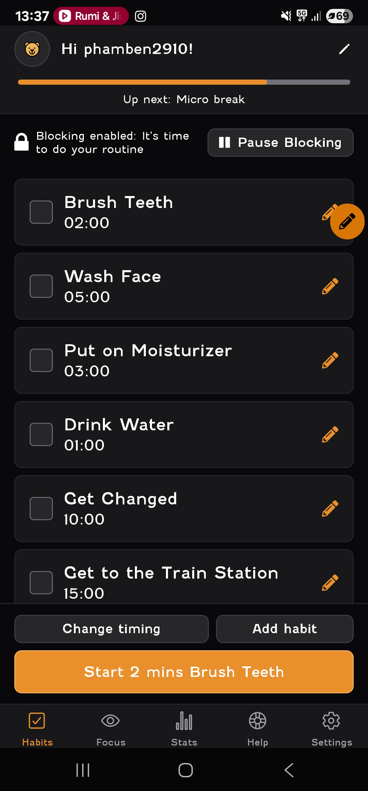
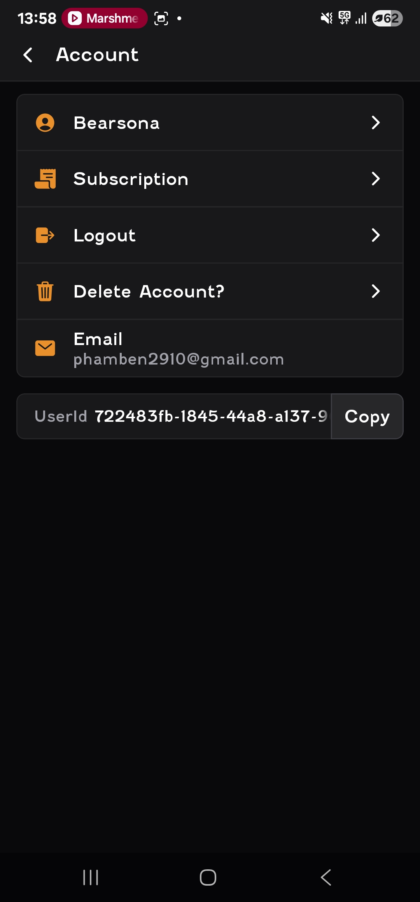
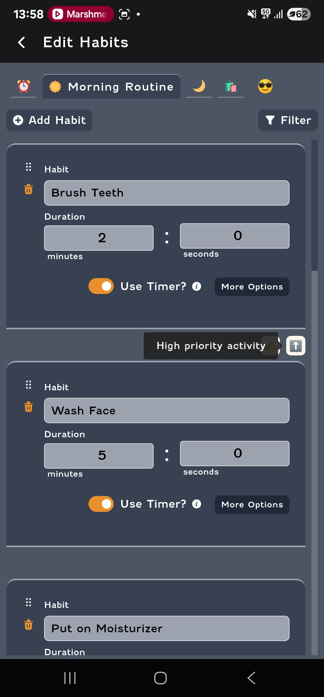
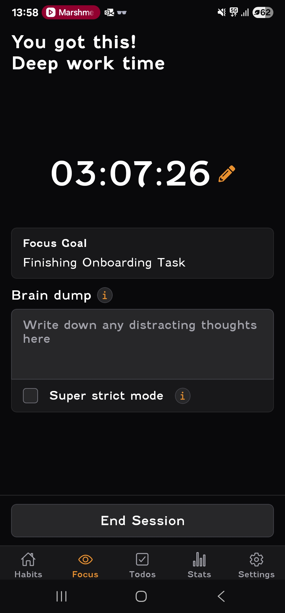

# Trying Out Focus Bear

✅ Confirmation: I have downloaded and tried out the Focus Bear app as instructed.

📍 Where/When: I completed the onboarding steps on 24 August 2025 using my Android phone.

📝 Notes from my first-time experience:

- The onboarding screens were visually clear, but I was initially unsure whether routines could be edited later (it wasn’t obvious until I clicked into one).
- The “set your first routine” step was easy to follow, but I wasn’t sure what the default reminder times meant until I tested saving.
- Notifications worked, but the permission request screen could use a short explanation of why notifications are necessary for focus.
- Overall, I found the flow smooth but I think adding more tooltips for first-time users would help.

📸 Screenshots:

