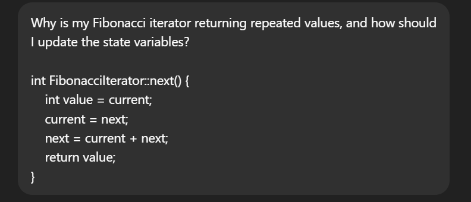

# AI Tools

1. Which AI tools did you try?

- I used ChatGPT to generate code snippets, debug simple problems, and explain
  new programming concepts.

1. What worked well? What didn’t?

- Worked well: Quickly producing correct code examples, offering explanations,
  suggesting debugging fixes, and saving time on learning new concepts.
- Didn’t work well: Some outputs lacked edge-case handling or optimization, and
  complex problems sometimes needed further clarification or testing.

1. When do you think AI is most useful for coding?

- AI is most useful for:
  - Learning new programming concepts with examples.
  - Debugging simple errors and suggesting fixes.
  - Generating boilerplate code or routine functions to save time.
  - Brainstorming approaches for problems, especially when stuck on syntax or
    structure.

PS: This Issue was mainly done using AI

I used ChatGPT while working on my university Data Structures assignment (COS30008). Specifically, I was implementing a Fibonacci iterator in C++ and ran into a logic bug where my iterator wasn’t advancing correctly.

I've used Claude to build the CI Workflow for this repository refer to the .yaml documents for specifications

