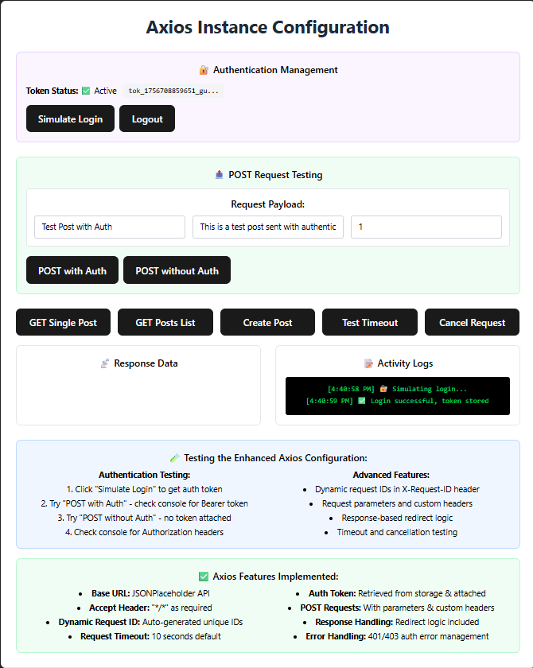

# API Calls

- Research how Axios works and why it's commonly used for API calls.

- Axios is a widely used JavaScript library designed to simplify HTTP requests from both the browser and Node.js. It provides a consistent and easy-to-use API for sending requests to APIs and handling responses, supporting all common HTTP methods such as GET, POST, PUT, DELETE, and PATCH. While the native fetch API is available in modern browsers, Axios offers several advantages that make it more convenient, reliable, and suitable for real-world applications, especially when working with complex APIs or handling JSON data.
  - How Axios Works:
    - Creating Requests: Axios allows developers to make HTTP requests using simple methods such as axios.get(url) for retrieving data or axios.post(url, data) for sending data. You can also use axios.put, axios.delete, and axios.patch to perform other CRUD operations, making it very versatile.
    - Promises-Based: Axios is built on promises, which means it supports both .then()/.catch() syntax and modern async/await. This makes handling asynchronous operations straightforward and allows developers to write cleaner, more readable code.
    - Automatic JSON Handling: Unlike fetch, Axios automatically parses JSON responses into JavaScript objects and also converts JS objects into JSON when sending data. This eliminates boilerplate code and reduces potential errors when handling API responses.
    - Request & Response Interceptors: Axios provides the ability to set up interceptors, which can intercept and modify requests or responses globally. For example, you can add authentication tokens to all requests automatically, log requests for debugging, or handle errors in a centralized way.
    - Error Handling: Axios provides consistent error handling. It throws errors for HTTP status codes outside the 2xx range, making it easier to detect failures. You can also differentiate between network errors and server-side errors, providing more precise error management.
    - Timeouts and Cancellation: Axios supports request timeouts and cancellation tokens, which are particularly useful in React applications. For example, if a component unmounts before an API request completes, you can cancel the request to prevent memory leaks or unwanted state updates.

  - Why Axios is Commonly Used:
    - Simplicity and Readability: Axios code tends to be cleaner and easier to understand than fetch, especially for sending JSON data or handling multiple requests.
    - Better Error Handling: By throwing errors automatically for non-2xx responses, Axios makes it easier to implement robust error handling in your application.
    - Automatic Transformations: Axios reduces boilerplate by automatically converting JSON data and handling content-type headers.
    - Browser Compatibility: Axios works reliably across older browsers without needing polyfills, unlike fetch.
    - Advanced Features: Features such as interceptors, custom instance configurations, and request cancellation make Axios particularly suitable for large-scale or enterprise-level applications, where API calls are frequent and require more control.

  - Practical Use in React:
    - In React, Axios is often used with useEffect to fetch data when components mount or when certain state or props change. It works seamlessly with useState to store API responses and update the UI dynamically. Additionally, Axios’ support for request cancellation ensures that if a component unmounts before a request completes, the app doesn’t attempt to update state on an unmounted component, preventing errors and improving performance.

- I successfully completed the Axios instance configuration according to the specified requirements. The instance is set up with a base URL for all API requests, default headers including accept: "_/_" and a dynamically generated request ID, and a timeout to prevent hanging requests. It uses AbortController to enable request cancellation when necessary. The instance retrieves an authentication token from local storage and attaches it to request headers if available, ensuring secure communication with the API. Error handling is implemented to catch and manage failed requests gracefully. Using this instance, I implemented a POST request to a specific endpoint with parameters, handled the response appropriately, and included logic to redirect the user when required. After thoroughly testing all features to ensure requests, cancellations, headers, and redirections function correctly, I committed the fully functional Axios instance to GitHub for version control and integration into the project.

- Why is it useful to create a reusable Axios instance?

- Creating a reusable Axios instance is useful because it centralizes common configuration for all API requests in one place. Instead of setting the base URL, headers, timeouts, and authentication logic in every request, you define them once in the instance. This ensures consistency, reduces repetitive code, and makes the application easier to maintain. It also allows you to apply interceptors, error handling, and cancellation logic globally, so every request automatically benefits from these features without duplicating code across components.

- How does intercepting requests help with authentication?

- Axios provides request interceptors, which are functions that run before a request is sent. Intercepting requests is useful for authentication because you can automatically attach tokens, session IDs, or other credentials to every request. For example, you can read a JWT token from local storage and add it to the Authorization header before sending the request. This ensures that all API calls are authenticated without manually adding the token to each request, reducing errors and improving security. Interceptors can also refresh tokens or redirect users if authentication fails.

- What happens if an API request times out, and how can you handle it?

- If an API request exceeds the timeout limit, Axios will automatically abort the request and throw an error. This prevents the application from hanging indefinitely while waiting for a response. You can handle timeouts by using try/catch blocks or .catch() to capture the error and provide feedback to the user, such as showing a message like “Request timed out, please try again.” Additionally, you can implement retry logic or fallbacks in case of temporary network issues. Using AbortController with Axios also allows you to cancel requests programmatically if the component unmounts or if a new request supersedes the old one.
