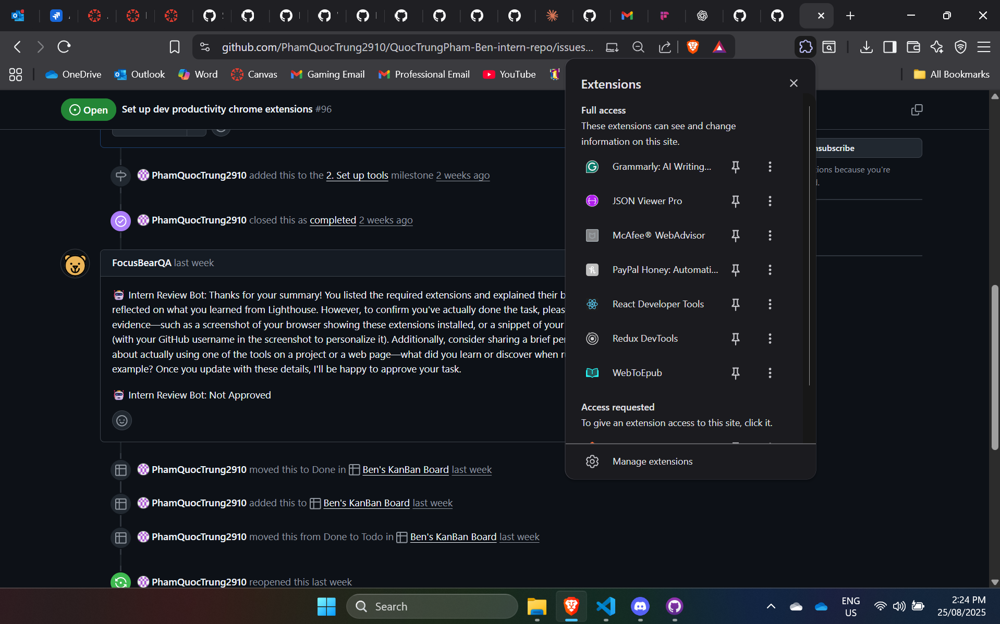
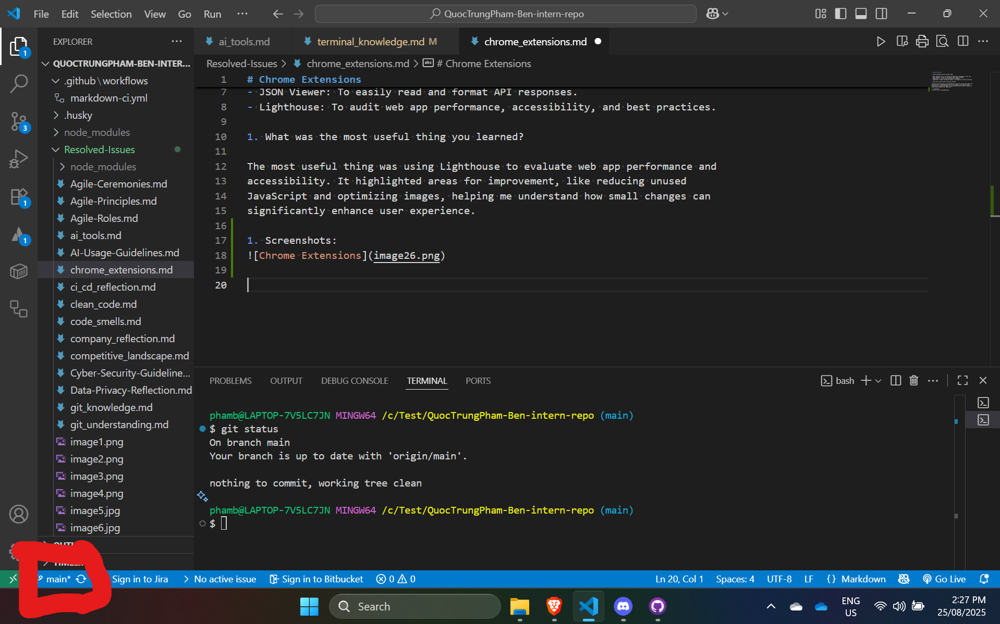

# Chrome Extensions

1. Which extensions did you install? Why?

- React Developer Tools: To inspect and debug React components in real time.
- Redux DevTools: To monitor and debug state changes in Redux.
- JSON Viewer: To easily read and format API responses.
- Lighthouse: To audit web app performance, accessibility, and best practices.

1. What was the most useful thing you learned?

The most useful thing was using Lighthouse to evaluate web app performance and
accessibility. It highlighted areas for improvement, like reducing unused
JavaScript and optimizing images, helping me understand how small changes can
significantly enhance user experience.

1. Screenshots:

