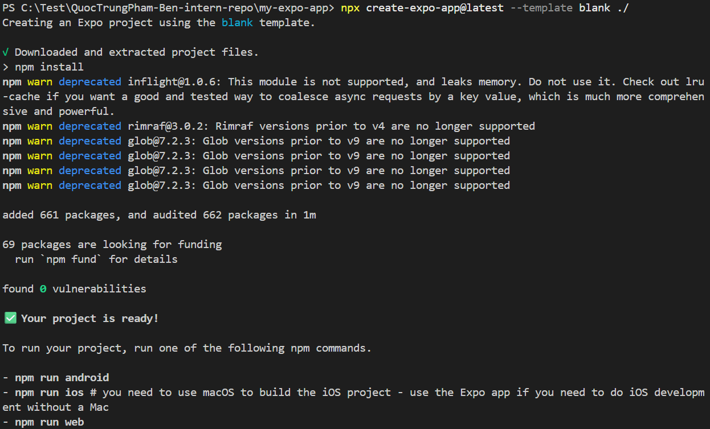
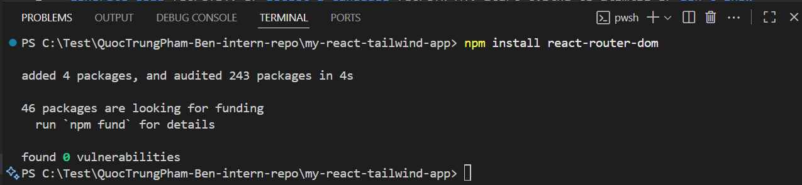
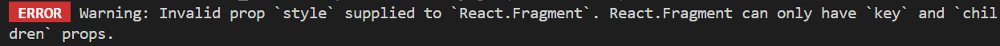
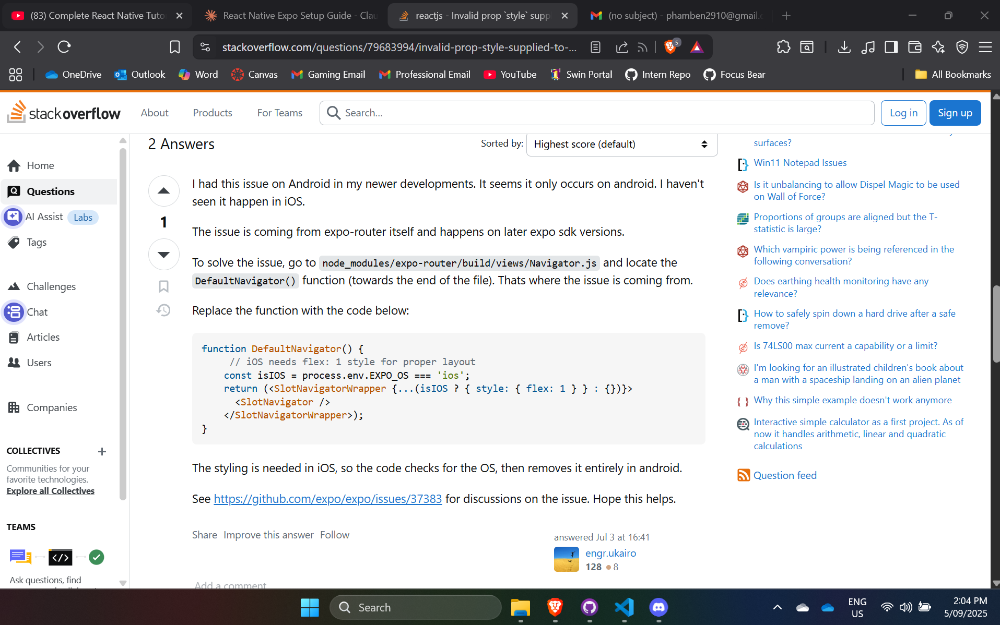

# React Native Environment Setup

- I successfully completed the initial setup for React Native development. I
  researched and installed all required dependencies, then created a new project
  using Expo. The project was run through the Metro server, where I tested both
  hot reloading and debugging features to confirm proper functionality. During
  the process, I encountered a setup issue with the latest version of
  expo-router, which caused an Android compatibility error in the navigation.js
  file. After consulting community resources on Stack Overflow, I resolved the
  issue by modifying the default navigator function. With this fix applied, the
  project runs smoothly and is ready for further development.

- What is the role of Metro in React Native development?

- Metro is the JavaScript bundler for React Native. It takes all the JavaScript
  code, assets, and dependencies in the project and bundles them into a format
  the mobile app can run. Metro also enables fast refresh (hot reloading), which
  lets developers see code changes immediately without rebuilding the entire
  app. Additionally, it manages debugging support and provides a development
  server that connects the app to the local environment.

- How does Expo simplify React Native development?

- Expo provides a managed workflow that makes setting up and running a React
  Native app much easier. It comes with pre-configured tools, libraries, and
  APIs (such as camera, notifications, and device sensors) so developers don’t
  have to manually configure native code for each platform. With Expo, you can
  quickly initialize a project, run it on a simulator or physical device using
  the Expo Go app, and use built-in debugging features. This reduces setup
  complexity and speeds up prototyping.

- What issues did you encounter, and how did you resolve them?

- While setting up the project, I encountered a compatibility issue with the
  latest version of expo-router on Android. The error originated from the
  navigation.js file, where the default navigator function caused crashes. To
  resolve this, I searched for solutions on Stack Overflow, found a recommended
  fix, and modified the navigator function to restore compatibility. After
  applying the change, the project ran successfully across platforms.
