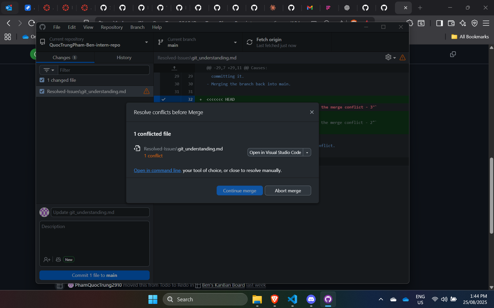
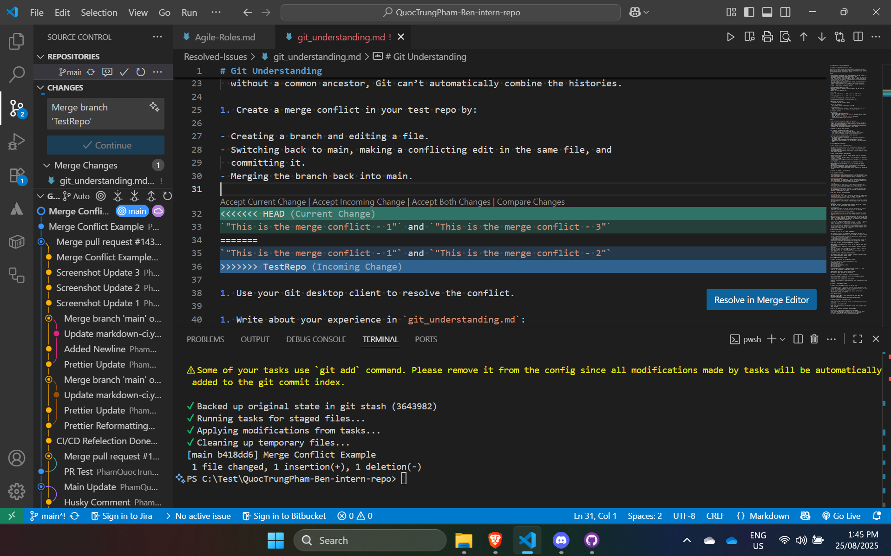
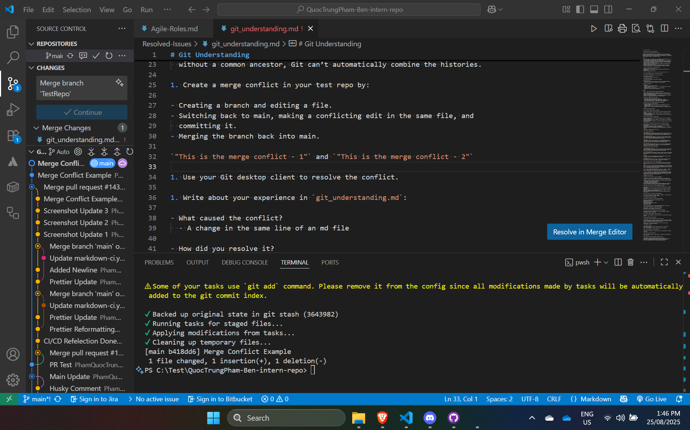

# Git Understanding

📌 Merge Conflicts & Conflict Resolution

1. Research what causes merge conflicts in Git.

Merge conflicts happen when Git cannot automatically reconcile differences
between two branches you’re trying to merge. This usually occurs when changes
affect the same lines of code or nearby sections in the same file, or when there
are incompatible changes in the project history.

Causes:

- Concurrent edits to the same lines: If two people edit the same line(s) in a
  file differently, Git doesn’t know which change to keep.
- Overlapping changes in nearby lines: Even if edits are not on the exact same
  line, if they’re close enough, Git might not be able to merge them cleanly.
- File deletions and modifications: If one branch deletes a file while another
  modifies it, Git will flag a conflict.
- Different changes to the same file metadata: Changes to file permissions or
  renaming can also cause conflicts.
- Merging unrelated histories: When trying to merge two repos or branches
  without a common ancestor, Git can’t automatically combine the histories.

1. Create a merge conflict in your test repo by:

- Creating a branch and editing a file.
- Switching back to main, making a conflicting edit in the same file, and
  committing it.
- Merging the branch back into main.

`"This is the merge conflict - 1"` and `"This is the merge conflict - 2"`

1. Use your Git desktop client to resolve the conflict.

1. Write about your experience in `git_understanding.md`:

- What caused the conflict?
  - A change in the same line of an md file

- How did you resolve it?
  - By letting the changes on both branch go through

- What did you learn?
  - Merge Conflicts are easy to resolve if you are able to understand what's
    causing the conflict and what changes are actually needed

1. Screenshots:
   
   
   
   

📌 Staging vs Committing

- Git Exercise
  - Modify a file and try the following:
  - Stage it but don’t commit (`git add <file>` or equivalent in your client).
  - Check the status (`git status`).
  - Unstage the file (`git reset HEAD <file>` or equivalent).
  - Commit the file and observe the difference.

Summary:

1. What is the difference between staging and committing?

- Staging means selecting specific changes you want to include in your next
  commit. The changes are placed into Git’s staging area, but they aren’t yet
  saved to the repository’s history.
- Committing means taking everything currently staged and creating a permanent
  snapshot in the repository’s history with a commit message.

1. Why does Git separate these two steps?

- Git separates staging and committing so you can:
  - Review and fine-tune exactly which changes go into a commit.
  - Group related changes into one commit and exclude unrelated changes.
  - Avoid committing incomplete or experimental edits accidentally.

1. When would you want to stage changes without committing?

- You might stage without committing when:
  - You want to prepare part of your work for a clean commit but are still
    making more edits.
  - You need to group related file changes together before committing.
  - You’re working on a large feature and want to commit it in logical chunks
    later.

📌 Branching & Team Collaboration

1. Why is pushing directly to main problematic?

- It can introduce bugs directly into the live, production-ready code without
  review.
- It bypasses collaboration checks, meaning mistakes or incomplete features
  could affect everyone.
- It makes tracking changes harder since all edits pile into one branch without
  clear feature separation.

1. How do branches help with reviewing code?

- Branches isolate changes so you can develop features, fixes, or experiments
  without touching main.
- They make it easier to open pull requests (or merge requests) for teammates to
  review before merging.
- They allow discussions, suggestions, and testing to happen before code reaches
  the main branch.

1. What happens if two people edit the same file on different branches?

- When the branches are later merged, Git will try to combine the changes
  automatically.
- If the edits affect the same lines or overlapping parts, Git can’t decide
  which version to keep — this creates a merge conflict.
- The conflict must be resolved manually by choosing, combining, or editing the
  changes.

📌 Advanced Git Commands & When to Use Them

1. What does each command do?

- `git checkout main -- <file>`
  This command allows you to restore a specific file from the main branch into
  your current working directory—without impacting other changes around it. It’s
  handy if you need to revert or inspect just one file from another branch.

- `git cherry-pick <commit>`
  This command applies the changes from a specific commit on another branch to
  your current branch. It’s especially useful when you want to integrate a bug
  fix or small improvement without merging the entire branch.

- `git log`
  This command shows the commit history of your repository—displaying each
  commit’s hash, author, date, and message. It’s a powerful way to review how
  the project has evolved and understand the context behind changes.

- `git blame <file>`
  The `git blame` command annotates each line in a file with information about
  who last modified it and when. It helps you trace code ownership—great for
  debugging or understanding code history.

1. When would you use it in a real project?

- `git checkout main -- <file>`
  If another developer fixed a bug in main and you just need that single file’s
  update without pulling everything else. For example, restoring a config file
  that you accidentally broke while working on a feature branch.

- `git cherry-pick <commit>`
  When a critical hotfix was committed to another branch and you need it applied
  to yours immediately, without merging unrelated changes. Common in production
  bug fixes.

- `git log`
  During code reviews or troubleshooting to understand when and why a feature
  was added, or to see what’s changed before a release.

- `git blame <file>`
  When debugging a problem and you need to see who last touched the affected
  code lines, so you can ask for context or understand the reasoning.

1. What surprised you while testing these commands?

- How `git checkout main -- <file>` instantly replaced only that file without
  touching anything else—super precise, almost like a “surgically removing an
  organ.”

- How `git cherry-pick` felt both powerful and dangerous, if you pick the wrong
  commit or have merge conflicts, you could end up spending a lot of time fixing
  them. I can already see myself messing this up and destroying hours of effort,
  so I'll definitely be careful with this one.

- `git log` has so many formatting options (`--oneline`, `--graph`, `--author`)
  that it can be turned into a quick visual history of the project. I hadn't
  used it regularly before so I didn't know that to exit you press `q`.

- `git blame` isn’t just for “blaming”—it’s more like a detective tool. Seeing
  the exact commit that last touched each line makes understanding code history
  so much faster. This looks like one I should definitely be using more and I
  probably will whenever an error has occurred.

📌 Debugging with git bisect

1. Research git bisect and how it helps in debugging.

- Git bisect is a built-in Git command that helps you find the commit that
  introduced a bug by performing a binary search through your project’s history.

- Instead of manually checking each commit one by one (which could be hundreds
  or thousands), Git bisect lets you mark:
  - A good commit (where the bug didn’t exist)
  - A bad commit (where the bug exists)
- Then Git automatically checks out commits halfway between them, letting you
  test until it narrows down the exact commit that introduced the problem.

1. When would you use it in a real-world debugging situation?

- When a bug or error appears in your project, but you don’t know which commit
  introduced it.
- Particularly useful in long-running projects with many commits or multiple
  developers.
- Ideal for regression bugs: something that used to work suddenly breaks, and
  you need to pinpoint the exact change causing it.
- Helps save time when the project history is too large to manually inspect
  every commit.

1. How does it compare to manually reviewing commits?

- Git bisect is faster, more accurate, scalable, systematic, and reduces human
  error compared to manually checking commits.

📌 Writing Meaningful Commit Messages

1. Research best practices for writing commit messages.

- Use a short, descriptive summary (50 characters or less)
- Separate subject and body
- Use imperative mood
- Be concise but informative
- Reference relevant issues or tickets
- Group related changes
- Use consistent style

1. Explore commit histories in an open-source GitHub project (e.g., React,
   Node.js) and analyze good vs. bad commit messages.

- Good examples: descriptive, concise, action-oriented.
- Bad examples: vague, ambiguous, non-descriptive.

1. How does a clear commit message help in team collaboration?

- Quick understanding, efficient code reviews, easier debugging, improved
  documentation, better coordination.

1. How can poor commit messages cause issues later?

- Confusion, slower debugging, inefficient reviews, poor project history, merge
  conflicts.

1. Commit Messages
- A vague commit message
- An overly detailed commit message.

📌 Creating & Reviewing Pull Requests

1. Research what a Pull Request (PR) is and why it’s used.

- A Pull Request (PR) is a feature used in version control systems like GitHub
  that allows developers to propose changes to a codebase and request that those
  changes be reviewed and merged into another branch.

- PRs are used for code review, collaboration, version control safety,
  documentation, testing and validation.

1. Pull Request Exercise:

- Review an existing PR in a public open-source repo (e.g., React PRs):
- Pull Request Reviewed -
  [React PR #34203](https://github.com/facebook/react/pull/34203)

1. Why are PRs important in a team workflow?

- Code review, collaboration, version control safety, documentation, testing &
  validation.

1. What makes a well-structured PR?

- Clear title and description, concise commits, linked issues, readable diffs,
  tests included.

1. What did you learn from reviewing an open-source PR?

- Collaborative reviews improve code quality and reduce bugs.
- Clear commit messages and PR descriptions make the review process faster.
- Discussions often highlight edge cases and alternative approaches.
- PRs serve as documentation for the reasoning behind changes.
