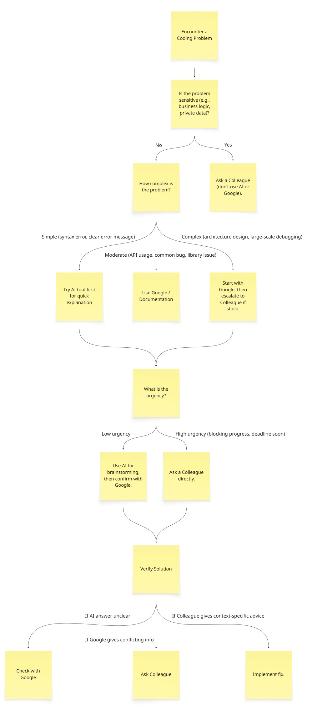

# Help Strategy

- Research best practices for troubleshooting coding problems and when is it
  helpful and when is it not?

- Effective troubleshooting begins with systematic debugging. Developers should
  start by reproducing the problem consistently, examining error logs, and
  reviewing recent code changes. Breaking the problem down into smaller pieces
  often reveals where the fault lies. Using documentation and test cases helps
  confirm whether code behaves as expected. Troubleshooting is most helpful when
  the issue is reproducible, well-documented, and within the developer’s
  knowledge scope. However, it becomes less effective when the issue stems from
  external factors (e.g., hardware failures, third-party outages) or when too
  much time is spent without progress, leading to diminishing returns.

- When do you prefer using AI vs. searching Google?

- AI tools are particularly helpful when you need context-specific explanations,
  such as debugging error messages in your own code or getting examples tailored
  to your stack. They can also summarize complex concepts quickly and provide
  step-by-step reasoning. In contrast, Google is better when you need official
  documentation, forum discussions (e.g., Stack Overflow), or authoritative
  updates from the maintainers of a library or framework. AI is useful for
  brainstorming or drafting code, while Google provides verifiable, up-to-date
  sources.

- How do you decide when to ask a colleague instead?

- Reaching out to a colleague is most appropriate when the problem involves
  team-specific context, such as internal code conventions, architecture
  decisions, or sensitive business logic that cannot be shared externally. It’s
  also valuable when urgency is high—colleagues can often point out solutions
  quickly without the need for extensive searching. However, colleagues’ time is
  limited, so it’s best to first attempt self-troubleshooting with AI and Google
  before escalating.

- What challenges do developers face when troubleshooting alone?

- Troubleshooting solo often leads to tunnel vision: developers may overlook
  simple mistakes because they are too close to the problem. Lack of feedback
  loops can also make it difficult to validate whether a chosen fix is correct
  or efficient. Additionally, searching online can result in information
  overload or outdated advice, while relying solely on AI risks incorrect or
  incomplete answers if not cross-checked. These challenges highlight the need
  for a structured decision-making framework.

- Miro Flow CHart: 
