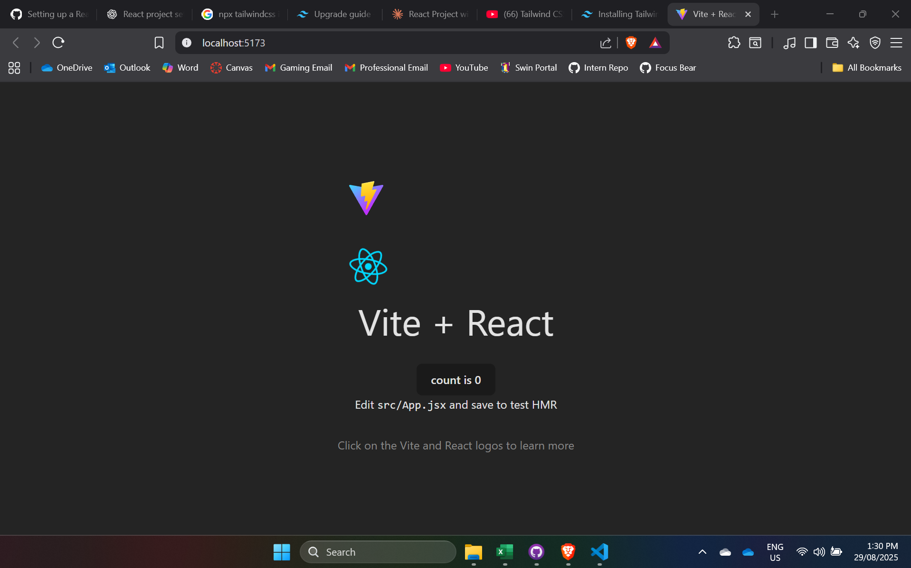

# React Fundamentals

📌 Setting Up the Environment

- I successfully completed the setup of a React project with Tailwind CSS, verified that the styling was applied correctly by running the project, and documented the process in a README.md file. The main challenge I faced during this task was finding the most recent and accurate guide for configuring Tailwind with the latest version of React and Vite. Once I located an up-to-date resource, the installation and configuration steps were straightforward. This experience helped me better understand how to integrate Tailwind into a React project and reinforced the importance of relying on current documentation when setting up new environments.

Screenshots:

📌 Understanding Components & Props

- I successfully completed the task by creating a functional React component called HelloWorld.jsx that displays the message "Hello, Focus Bear!". I enhanced the component to accept a prop called name, allowing it to display the value dynamically, which makes the component reusable with different names. After implementing and testing the component locally to ensure it renders correctly, I committed the changes and pushed the component to GitHub, ensuring the project repository is updated with the latest work.
  

- Why are components important in React?
  - Components are essential in React because they allow developers to break the user interface into small, reusable, and manageable pieces. Each component can encapsulate its own structure, styling, and behavior, enabling a clear separation of concerns and making the code easier to maintain and debug. Components can be composed together to build complex UIs, reused across different parts of an application, and maintain their own state to create dynamic, interactive experiences. This modular approach improves readability, scalability, and testability, making applications more efficient to develop and maintain over time.

📌 Handling State & User Input

- I successfully completed the task by creating a new component called Counter.js, which features a button that increments a number each time it is clicked. I utilized the useState hook to manage the count value, ensuring that the state updates correctly with each interaction. The component dynamically displays the updated count, providing real-time feedback as the button is pressed. After implementing and testing the functionality, I pushed the completed component to GitHub for version control and project integration.

- What happens if we modify state directly instead of using setState?

- If we modify state directly instead of using setState, React will not recognize that the state has changed, so it won’t trigger a re-render of the component. This means that even though the value in memory is updated, the UI will not reflect the change, leading to inconsistencies between the data and what the user sees. React enforces the use of setState (or the updater function from useState) because it ensures state updates are tracked, re-renders are scheduled properly, and the virtual DOM can efficiently update the UI. Directly mutating state can break React’s update cycle and cause unpredictable behavior in the application.
