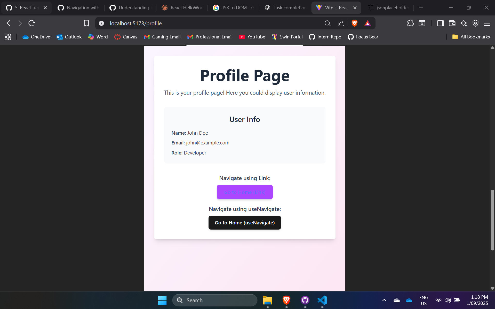

# React Fundamentals

📌 Setting Up the Environment

- I successfully completed the setup of a React project with Tailwind CSS, verified that the styling was applied correctly by running the project, and documented the process in a README.md file. The main challenge I faced during this task was finding the most recent and accurate guide for configuring Tailwind with the latest version of React and Vite. Once I located an up-to-date resource, the installation and configuration steps were straightforward. This experience helped me better understand how to integrate Tailwind into a React project and reinforced the importance of relying on current documentation when setting up new environments.

Screenshots:

📌 Understanding Components & Props

- I successfully completed the task by creating a functional React component called HelloWorld.jsx that displays the message "Hello, Focus Bear!". I enhanced the component to accept a prop called name, allowing it to display the value dynamically, which makes the component reusable with different names. After implementing and testing the component locally to ensure it renders correctly, I committed the changes and pushed the component to GitHub, ensuring the project repository is updated with the latest work.
  

- Why are components important in React?
  - Components are essential in React because they allow developers to break the user interface into small, reusable, and manageable pieces. Each component can encapsulate its own structure, styling, and behavior, enabling a clear separation of concerns and making the code easier to maintain and debug. Components can be composed together to build complex UIs, reused across different parts of an application, and maintain their own state to create dynamic, interactive experiences. This modular approach improves readability, scalability, and testability, making applications more efficient to develop and maintain over time.

📌 Handling State & User Input

- I successfully completed the task by creating a new component called Counter.js, which features a button that increments a number each time it is clicked. I utilized the useState hook to manage the count value, ensuring that the state updates correctly with each interaction. The component dynamically displays the updated count, providing real-time feedback as the button is pressed. After implementing and testing the functionality, I pushed the completed component to GitHub for version control and project integration.

- What happens if we modify state directly instead of using setState?

- If we modify state directly instead of using setState, React will not recognize that the state has changed, so it won’t trigger a re-render of the component. This means that even though the value in memory is updated, the UI will not reflect the change, leading to inconsistencies between the data and what the user sees. React enforces the use of setState (or the updater function from useState) because it ensures state updates are tracked, re-renders are scheduled properly, and the virtual DOM can efficiently update the UI. Directly mutating state can break React’s update cycle and cause unpredictable behavior in the application.

📌 Working with Lists & User Input

- I completed the task by creating a simple form component that includes an input field and a button. The input field allows users to type text, and when the button is clicked, the entered text is added to a list that is managed using React’s useState hook. The list is then displayed dynamically by iterating over the state array with the .map() method, ensuring that each new entry is rendered immediately in the UI. After testing the functionality to confirm that items are added and displayed correctly, I pushed the form component to GitHub for version control and integration into the project.

- What are some common issues when working with lists in React?

- Some common issues when working with lists in React include forgetting to provide a unique key prop when rendering list items with .map(), which can cause inefficient re-rendering or unexpected UI behavior. Another issue is using the array index as the key, which can lead to problems if the list changes dynamically, since React may not correctly track which items were added, removed, or updated. Developers may also run into state mutation issues if they modify the array directly instead of creating a new copy before updating state, which prevents React from recognizing changes. Additionally, handling empty input values or duplicate entries can cause unintended results if proper validation isn’t implemented. Finally, performance issues can arise when rendering very large lists without optimizations like virtualization.

📌 Navigation with React Router

- I installed React Router and set up a basic routing system to enable navigation within the app. I created two separate pages, Home.jsx and Profile.jsx, each serving as a distinct component with its own content. Using React Router’s Routes and Route components, I defined paths for / to render the Home page and /profile to render the Profile page. For navigation, I added links using the Link component so users can easily switch between Home and Profile, and also tested navigation using useNavigate for programmatic routing. After confirming that the routes worked correctly and navigation functioned as expected, I pushed the completed routing setup to GitHub.
  
  

- What are the advantages of client-side routing?

- Client-side routing offers several advantages over traditional server-side routing. Since navigation happens within the browser without requiring a full page reload, it provides a faster and smoother user experience, making applications feel more like native apps. It also reduces unnecessary network requests because only the necessary data is fetched, not an entire new HTML page. With client-side routing, developers can build single-page applications (SPAs) where state and layout persist across pages, avoiding re-rendering of shared components like headers or sidebars. Additionally, it allows for more flexible and dynamic navigation, such as programmatic redirects and protected routes, while enabling better separation of concerns between frontend and backend.

📌 Understanding React Hooks: useEffect

- Research how useEffect works and when to use it.

- The useEffect hook in React is used to handle side effects inside functional components. A side effect means anything that happens outside the normal process of rendering the UI. Rendering is considered a "pure" operation — it should take the component’s props and state, and return JSX without changing things elsewhere. Side effects break that purity, for example:
  - Data fetching (calling an API).
  - Subscriptions (listening to events like window resizing or WebSocket messages).
  - Timers (using setTimeout or setInterval).
  - Direct DOM manipulation (changing elements outside React’s control).

- How it works: useEffect takes a callback function that React runs after the component renders. This ensures side effects don’t block the initial paint of the UI.

- It also takes an optional dependency array as the second argument:
  - [] → Runs only once after the first render (mount).
  - [value1, value2] → Runs again whenever one of these dependencies changes.
  - No array → Runs after every render.

- Cleanup: The function passed to useEffect can return another function called a cleanup function. React will call this cleanup before the effect runs again or when the component is removed from the DOM. Cleanup is important to prevent memory leaks (when resources like event listeners or intervals are left hanging around).

Important Terminology:

- Render: The process where React calls your component and generates the UI (JSX → DOM).
- Side effect: Any action outside of rendering that interacts with external systems or changes state beyond simple rendering.
- Dependency array: A list of values React watches to decide when to re-run the effect.
- Cleanup function: A function returned inside useEffect to undo or stop the side effect when needed.
- Mount: When a component is first added to the DOM.
- Unmount: When a component is removed from the DOM.

- I created a React component that demonstrates lifecycle behavior, data fetching, and cleanup. When the component mounts, it logs a message to the console, and when it unmounts, it logs a different message to indicate it was removed. The component includes a button that, when clicked, triggers a fetch request to an API in this case, a placeholder JSON API and displays the retrieved data. I used the useEffect hook with a cleanup function to cancel any ongoing requests or clear resources when the component unmounts, ensuring no memory leaks occur. After testing the functionality, confirming that messages appear on mount/unmount, data fetch works on button click, and cleanup runs properly I pushed the completed component to GitHub.
  
  

- When should you use useEffect instead of handling logic inside event handlers?

- You should use useEffect when the logic needs to run as a side effect of rendering or state/prop changes, not just in response to a user action. For example:
  - Fetching data when the component mounts.
  - Subscribing to events like window resize or WebSocket updates.
  - Updating the document title based on state.
- Event handlers are only triggered by direct user actions (clicks, typing, etc.), whereas useEffect handles tasks that need to run automatically after rendering or when certain dependencies change.

- What happens if you don’t provide a dependency array?

- If you omit the dependency array, React will run the effect after every render, including re-renders caused by state or prop changes. This can lead to:
  - Repeated API calls or computations on every render.
  - Unnecessary re-renders or side effects that degrade performance.
  - Providing the dependency array controls when the effect runs, making it predictable and efficient.

- How can improper use of useEffect cause performance issues?

- Running expensive computations or API calls on every render by forgetting the dependency array.
- Creating memory leaks by not including cleanup functions (e.g., intervals, subscriptions).
- Causing infinite loops if the effect updates a state that is also listed in its dependency array incorrectly.
- Re-rendering large components unnecessarily, which can make the UI sluggish.
