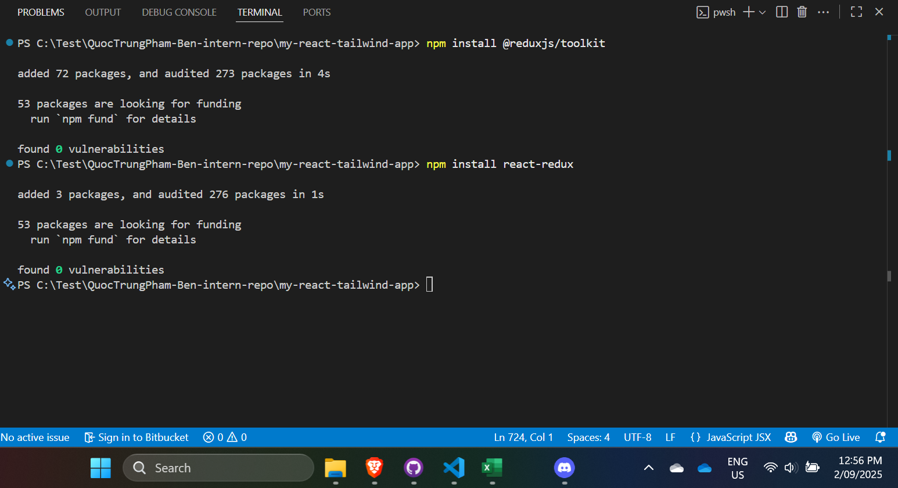
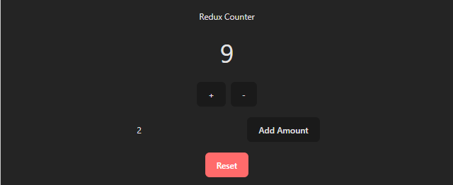
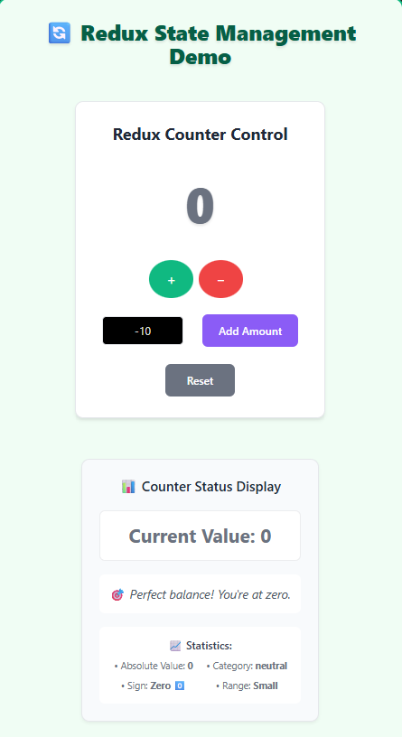
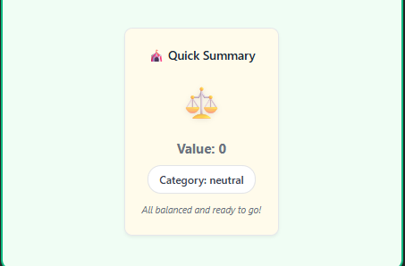
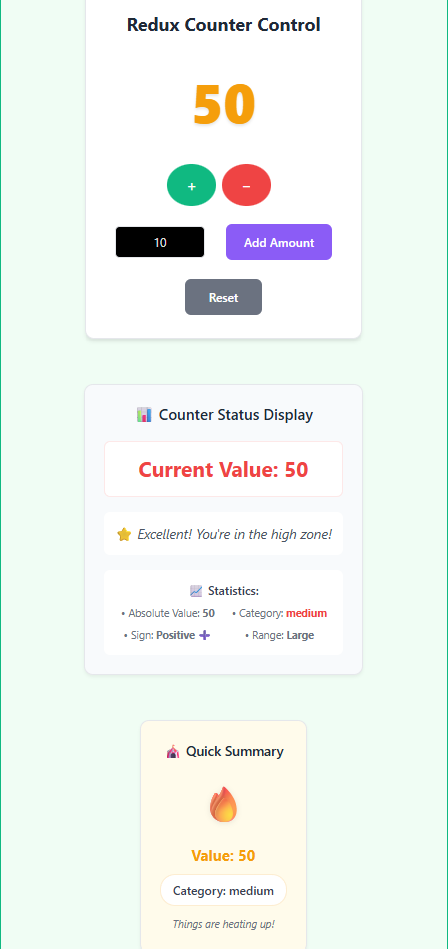
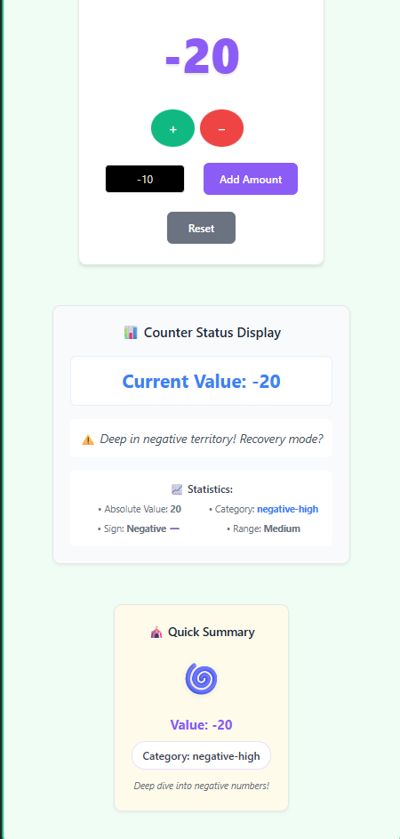

# Redux Fundamentals

📌 Introduction to Redux Toolkit (State Management)

- I successfully set up state management in my project using Redux Toolkit and
  React Redux. I began by installing the necessary libraries and then created a
  Redux store along with a dedicated slice to manage the counter state. To
  integrate the store with my React components, I used the useSelector hook to
  read the counter value and the useDispatch hook to trigger state updates
  within the Counter.js component. Finally, I pushed the completed Redux setup
  to GitHub, ensuring my progress is version-controlled and accessible for
  future development.
  
  

- When should you use Redux instead of useState?

- You should use Redux instead of useState when your application requires
  managing global state that needs to be shared across multiple components, or
  when the state logic becomes too complex for local management. While useState
  is great for simple, component-level state, Redux provides a centralized
  store, making it easier to handle cross-component communication, ensure
  predictable updates, and scale as your app grows.

📌 Using Selectors in Redux Toolkit

- I extended my Redux setup by adding selector functions in counterSlice.js to
  cleanly retrieve the current counter value from the store. Using these
  selectors with the useSelector hook, I accessed the counter value in multiple
  components, including the new CounterSummary.jsx for a quick overview and
  CounterDisplay.jsx for showing status messages. I also modified the app to
  conditionally display different messages based on the counter value, making
  the UI more dynamic and responsive to state changes. Finally, I pushed all
  updates, including the new components and Redux improvements, to GitHub for
  version control and collaboration.

  
  
  
  

- What are the benefits of using selectors instead of directly accessing state?
- Encapsulation – Selectors hide the structure of the state, so components don’t
  need to know how the state is organized. If the state shape changes later, you
  only update the selector, not every component.
- Reusability – A selector can be reused across multiple components, avoiding
  duplication of logic.
- Readability – Selectors make code cleaner and more expressive by giving
  descriptive names to state queries (e.g., selectCounterValue instead of
  state.counter.value).
- Testability – Since selectors are pure functions, they can be easily
  unit-tested without involving components.
- Performance – With tools like Reselect, selectors can be memoized, preventing
  unnecessary re-renders by only recalculating when the relevant part of the
  state changes.
