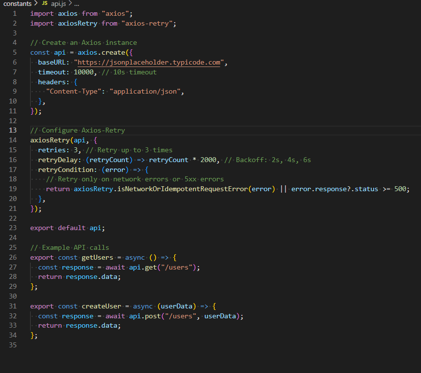

# RN API Calls

- Research how API calls work in React Native (fetch vs Axios)

- In React Native, API calls are typically handled through the native JavaScript
  fetch API or with third-party libraries like Axios. The fetch function is
  built into JavaScript and provides a low-level way of making HTTP requests,
  returning promises that resolve with the raw Response object. This requires
  developers to manually parse JSON, handle headers, and implement features like
  request cancellation or timeouts, which can add extra code. Axios, on the
  other hand, is a popular HTTP client library that provides a higher-level
  abstraction with features such as automatic JSON parsing, request/response
  interceptors, simpler error handling, and support for advanced configurations
  like base URLs and query parameters. While both approaches work effectively,
  Axios often reduces boilerplate code and improves developer productivity when
  working with APIs in React Native applications.

- Understand error handling and response caching strategies

- Error handling in React Native API calls typically involves wrapping requests
  in try...catch blocks or chaining .catch() onto promises to capture network
  and server-related issues. Developers often categorize errors into different
  types, such as client-side errors (bad request), server-side errors (internal
  server errors), and network failures (no internet connection), then respond
  accordingly, for example, by displaying user-friendly error messages or
  prompting retries. For response caching, strategies differ depending on the
  library used. With fetch, caching must be implemented manually, often by
  storing responses in AsyncStorage or a state management solution like Redux.
  Axios, however, can be extended with middleware like axios-cache-adapter,
  which provides built-in caching strategies, such as memory caching or
  persistent storage caching, helping reduce unnecessary network calls and
  improving app responsiveness, particularly in mobile environments with
  unreliable connectivity.

- Why is Axios preferred over fetch in some cases?

- Axios is often preferred over fetch because it streamlines common tasks
  involved in making API calls and handling responses. Unlike fetch, Axios
  automatically parses JSON responses, reducing the need for repetitive
  boilerplate code. It also offers built-in request cancellation via
  cancellation tokens, which is particularly important in React Native where
  users may quickly navigate between screens and leave requests hanging. Axios
  simplifies adding headers, query parameters, and request bodies, whereas with
  fetch, developers must often manually construct these. Additionally, Axios
  provides consistent error handling by clearly distinguishing between different
  types of errors, while fetch only rejects a promise on network failures and
  requires additional handling for HTTP errors like 404 or 500. These usability
  improvements, combined with support for request/response interceptors and
  easier integration with retry and caching libraries, make Axios a more
  convenient and reliable choice in many real-world applications.

- How does Axios-Retry improve network reliability?

- Axios-Retry is an Axios plugin that enhances network reliability by
  automatically retrying failed requests under specific conditions. This is
  especially useful in mobile environments, where users often experience
  fluctuating network connectivity or temporary server downtime. By default,
  Axios-Retry can be configured to retry requests that fail due to network
  errors, request timeouts, or specific HTTP status codes like 429 (Too Many
  Requests) or 5xx (server errors). Developers can customize retry behavior,
  including the number of retries, the delay between retries, and the backoff
  strategy (such as exponential backoff to avoid overwhelming servers). This
  ensures that transient errors don’t immediately translate into poor user
  experiences and helps maintain app stability. For instance, if a request fails
  due to a momentary signal drop, Axios-Retry will automatically reattempt the
  request, reducing the need for users to retry actions manually.

- How would you handle API failures gracefully in a React Native app?

- Handling API failures gracefully in a React Native app involves designing the
  app to provide resilience and a good user experience, even when the network or
  server fails. A common strategy is to present clear and user-friendly error
  messages when something goes wrong, instead of leaving the user with no
  feedback. Implementing retry mechanisms, either automatically with libraries
  like Axios-Retry or manually by offering a “Try Again” button, can reduce
  frustration. For critical data, developers may use offline-first strategies,
  caching responses locally with tools like AsyncStorage or SQLite so users can
  still access data without connectivity. Graceful degradation is also
  important, meaning the app continues to function in a limited capacity instead
  of completely failing. Developers should also log errors to monitoring
  services (e.g., Sentry or Firebase Crashlytics) to detect recurring issues.
  Combining these strategies ensures that API failures are handled in a way that
  preserves user trust and app reliability.

- Implement API calls using Axios & Using Axios-Retry to handle network failures

