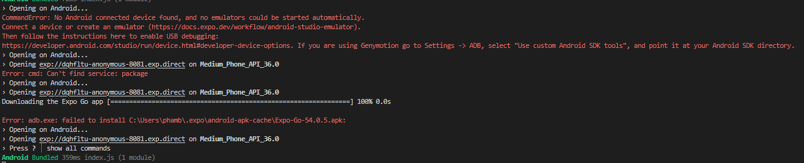
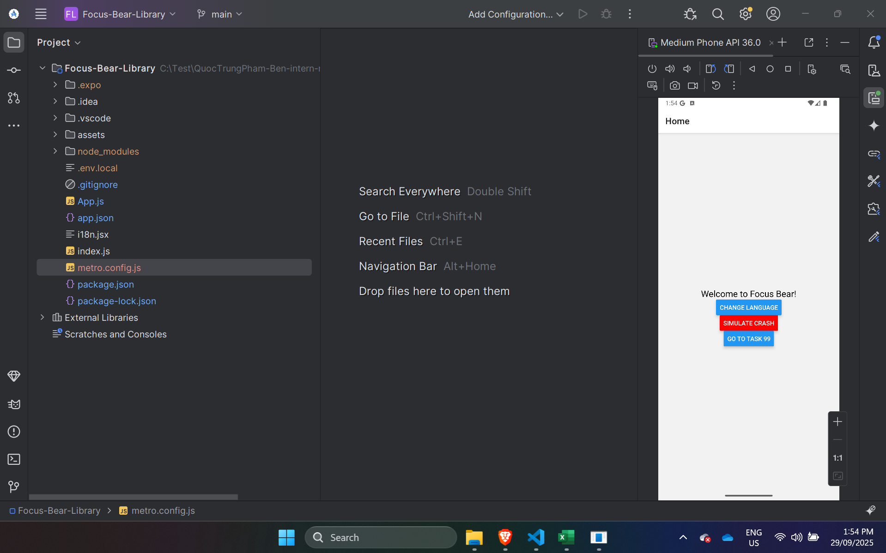

# RN Deep Linking

- Research deep linking in React Native

- Deep linking in React Native allows an app to be opened directly to a specific
  screen or piece of content using a URL. This means instead of always landing
  on the home page, a user could open a link that takes them straight to a
  product page, a profile, or a message thread inside the app. Deep linking can
  be set up in different ways, such as using custom URI schemes like
  myapp://product/123, or universal/app links that use real HTTPS URLs.
  Universal links are generally recommended because they work more smoothly
  across platforms and provide a web fallback when the app is not installed.

- What are the benefits of deep linking in mobile apps?

- The benefits of deep linking are significant for user experience and business
  goals. For users, it removes friction by taking them directly to the content
  they expect, which increases satisfaction and engagement. For businesses, it
  improves retention and re-engagement because links in emails, ads, or
  notifications can bring users back to specific parts of the app. Deep linking
  also supports marketing and analytics by enabling tracking of campaigns and
  attribution of installs. Additionally, universal links allow seamless
  continuity between web and app, ensuring the same link can work on both
  platforms.

- How does React Navigation handle deep linking?

- React Navigation provides built-in support for deep linking by integrating
  with React Native’s Linking API. You configure it by defining URL prefixes
  (such as your app’s custom scheme or website domain) and mapping paths to
  specific screens. This configuration allows React Navigation to handle both
  cold starts, when the app is opened for the first time via a link, and runtime
  events, when a link is clicked while the app is already running. Developers
  can also handle nested navigation by defining configurations for sub-routes,
  making the system flexible and scalable for large apps.

- What challenges might arise when implementing deep linking?

- However, there are challenges that come with implementing deep linking.
  Setting up universal links requires platform-specific configuration, such as
  hosting apple-app-site-association files for iOS and assetlinks.json for
  Android, which can be tricky to get right. Handling links during cold starts
  and warm starts can cause issues if navigation stacks are not initialized
  properly. Deep linking into protected content, such as screens behind
  authentication, requires additional logic to store the intended destination
  and resume navigation after login. Other challenges include managing multiple
  URL patterns, testing links across devices and environments, and dealing with
  deferred deep links, where a user installs the app after clicking the link.
  Developers also need to be aware of potential collisions with custom URI
  schemes and consider security when configuring their deep link setup.

