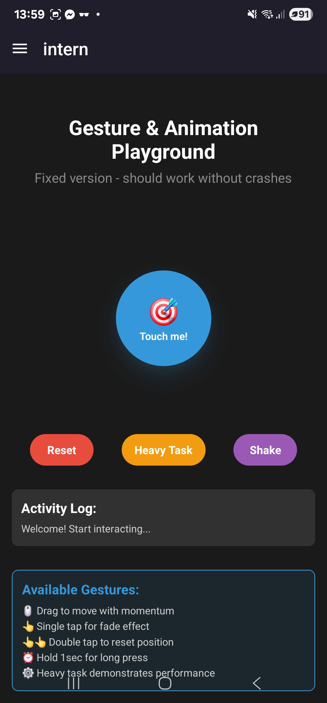
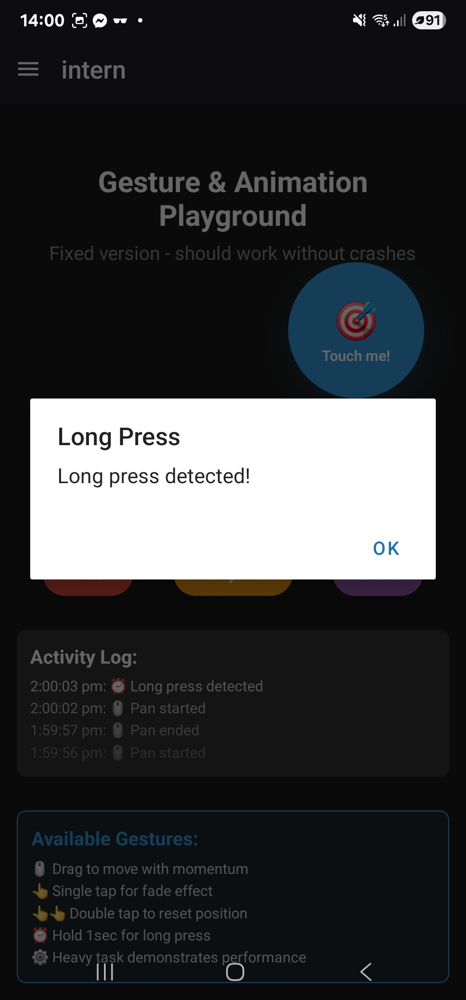
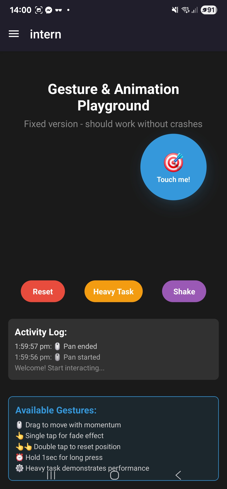
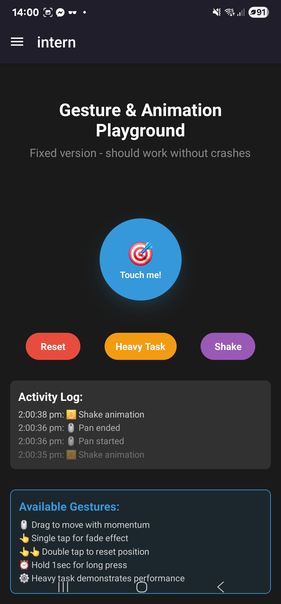

# RN Gestures & Animations

- Research gesture handling in React Native (react-native-gesture-handler)

- React Native’s core touch system provides basic support for presses and
  gestures, but more advanced interactions can be difficult to implement
  smoothly. The react-native-gesture-handler library extends this capability by
  offering a more declarative and performant way to handle gestures such as
  swipes, pans, long presses, and multi-touch interactions. It offloads much of
  the gesture detection to the native side, which reduces lag and improves
  responsiveness. This makes it especially valuable in complex UIs where
  multiple gestures may overlap or compete for priority.

- Explore how animations work (react-native-reanimated)

- The react-native-reanimated library is a powerful tool for creating smooth,
  highly performant animations in React Native. Unlike the standard Animated
  API, Reanimated allows most animation logic to run directly on the UI thread
  rather than the JavaScript thread. This means animations remain fluid even if
  the JavaScript thread is busy with other computations or rendering tasks.
  Reanimated also introduces a declarative approach for defining animations and
  supports advanced features such as gesture-based animations, shared values,
  and synchronization with layout transitions.

- Experiment with basic gestures like swiping and long press
  
   

- Create a simple animation using Animated API

- Investigate the role of InteractionManager

- The InteractionManager in React Native is designed to coordinate animations,
  gestures, and other interactions with ongoing UI updates. It ensures that
  expensive operations, such as rendering or heavy computations, do not
  interfere with critical interactions like touch gestures or animations. By
  deferring non-essential work until after interactions are complete,
  InteractionManager helps maintain smooth and responsive UIs, preventing
  dropped frames and lag that would otherwise degrade the user experience.

- What are the differences between Animated and react-native-reanimated?

- The key difference between the Animated API and react-native-reanimated lies
  in where the animation logic is executed. Animated runs most of its
  calculations on the JavaScript thread, which makes it simpler to use but more
  vulnerable to performance issues if the thread is blocked. In contrast,
  Reanimated shifts the work to the UI thread, ensuring animations remain fluid
  and responsive regardless of JavaScript workload. Reanimated also offers more
  advanced features, such as gesture integration, shared values, and lower-level
  control over animation behavior, while Animated remains better suited for
  quick prototypes and simple animations.

- How does react-native-gesture-handler improve gesture performance?

- react-native-gesture-handler improves performance by delegating gesture
  recognition and event handling to the native layer instead of relying solely
  on React Native’s JavaScript event system. This reduces delays caused by the
  asynchronous bridge between JavaScript and native code, allowing gestures to
  feel more immediate and responsive. Additionally, it provides a more flexible
  gesture system that can handle complex interactions like nested gestures,
  gesture cancellation, and simultaneous recognition without the conflicts
  common in the standard touch system.

- When would you use gestures instead of buttons in a UI?

- Gestures are often preferable to buttons when the interaction should feel more
  natural, immersive, or context-dependent. For example, swiping to delete an
  item, dragging to reorder a list, or pinching to zoom provides a fluid and
  intuitive experience that matches user expectations on mobile devices.
  Buttons, on the other hand, are clearer for discrete, explicit actions like
  submitting a form or opening a menu. Gestures shine in scenarios where direct
  manipulation of elements is more efficient and engaging than tapping static
  controls.

- Why is InteractionManager.runAfterInteractions necessary?

- InteractionManager.runAfterInteractions ensures that tasks are executed only
  after ongoing interactions, such as gestures or animations, have finished.
  Without this, heavy computations or background work might interfere with the
  responsiveness of critical UI interactions, causing frame drops or stutters.
  By queuing non-urgent tasks to run after interactions are complete, developers
  can balance performance with functionality, maintaining smooth animations and
  touch handling while still completing necessary background work.

- While the above is true for other sample codes i saw when i used
  "InteractionManager.runAfterInteractions" it gives me a warning that it was
  deprecated so i have sinced stop using it in favor of requestAnimationFrame.
