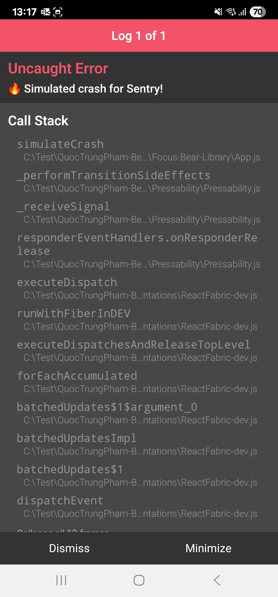

# RN Logging

- Research how Sentry works in React Native

- Sentry works in React Native by providing an SDK that integrates directly into
  the JavaScript and native layers of the application. Once initialized with a
  project’s DSN, it automatically captures runtime errors, unhandled promise
  rejections, and crashes that occur on both iOS and Android. Beyond just error
  reporting, Sentry also supports performance monitoring, capturing metrics such
  as app startup time, network request delays, and UI responsiveness. Developers
  can log custom messages, attach additional context, and leave breadcrumbs that
  trace user actions leading up to an error. This creates a detailed timeline of
  events that helps developers understand the sequence of actions before the
  issue occurred. By combining automatic crash reporting with custom
  instrumentation, Sentry provides a holistic view of an app’s stability in
  production.

- Why is logging important in a production React Native app?

- Logging is crucial in production because it provides visibility into how the
  app behaves in real-world conditions. Unlike development, where errors are
  easily reproducible, production environments involve a wide variety of
  devices, operating systems, network conditions, and user behaviors. Without
  proper logging, many issues would go unnoticed until users start reporting
  them, which delays resolution and hurts user experience. Logs help developers
  identify problems proactively, monitor app performance, and track non-fatal
  issues before they escalate into crashes. They also provide an audit trail of
  events that occurred, which is invaluable for debugging, security monitoring,
  and optimizing performance.

- How does Sentry improve debugging and issue tracking?

- Sentry improves debugging and issue tracking by automatically aggregating and
  categorizing errors across different devices and environments. Instead of just
  receiving vague user complaints, developers get detailed error reports with
  stack traces, device information, OS versions, and even the sequence of user
  interactions (breadcrumbs) that led to the failure. This allows teams to
  reproduce bugs more accurately and fix them faster. Additionally, Sentry
  groups recurring issues together, so teams can see which problems affect the
  most users and prioritize them accordingly. With real-time alerts, developers
  are notified as soon as critical issues occur, enabling a proactive rather
  than reactive approach to app stability.

- What are best practices for handling and logging errors?

- When handling and logging errors, it’s important to strike a balance between
  capturing useful information and avoiding noise. Best practices include always
  catching expected errors (such as network failures) and providing fallback
  behaviors, while letting Sentry capture unexpected exceptions automatically.
  Developers should use different log levels—such as debug, warning, and
  error—to distinguish the severity of issues. Sensitive user information should
  never be logged, as this can lead to security risks. Adding contextual data,
  such as which screen the user was on or which API call failed, greatly
  improves the usefulness of logs. Finally, testing error reporting during
  development—by simulating crashes or failed API requests—ensures that the
  logging system is correctly configured before going live.

