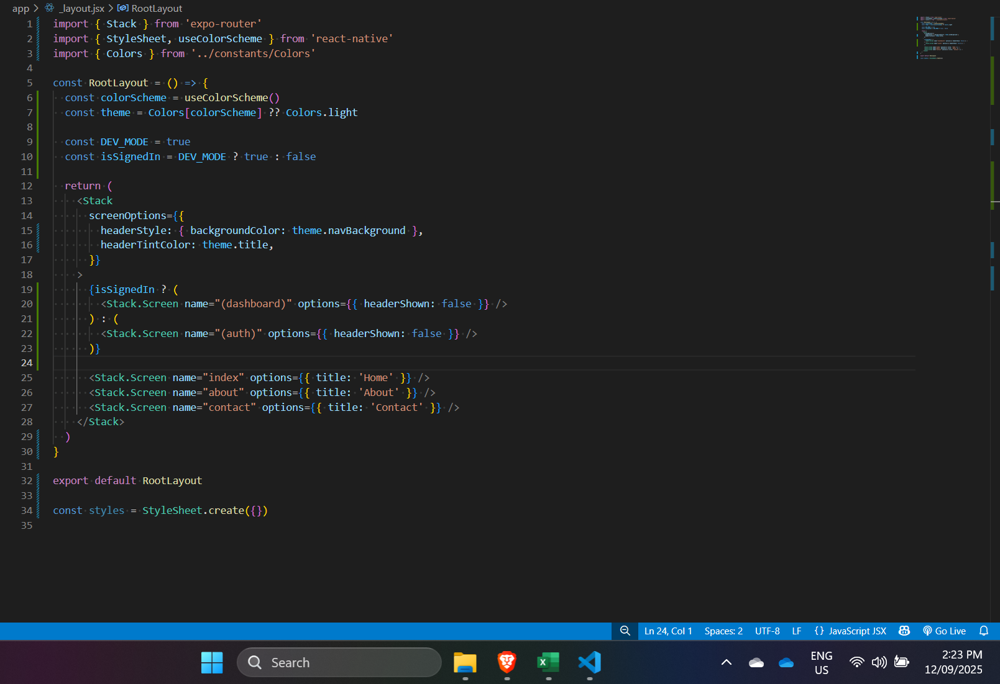
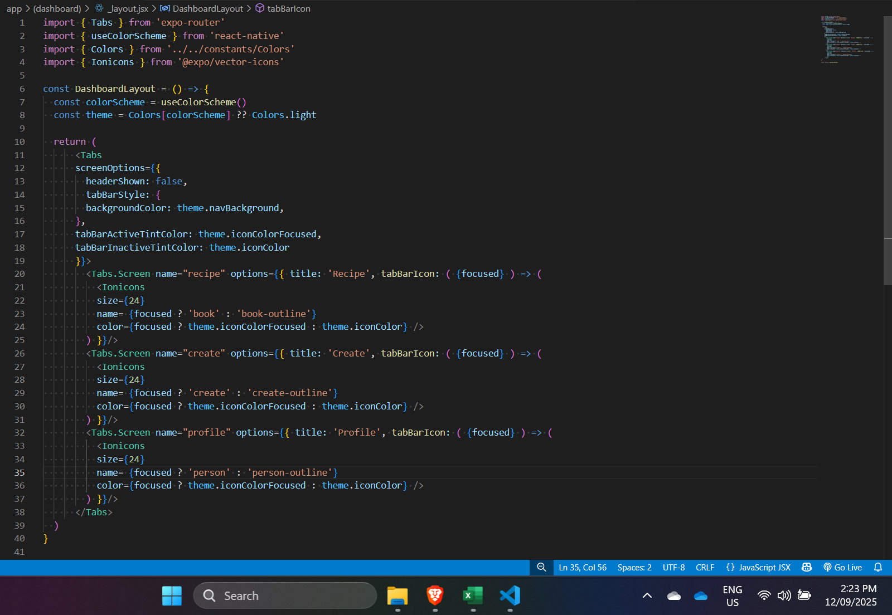
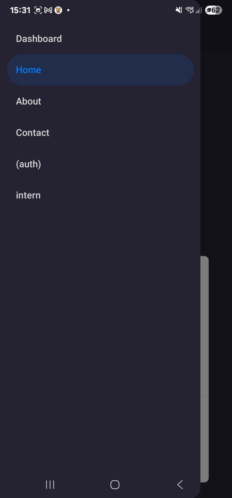
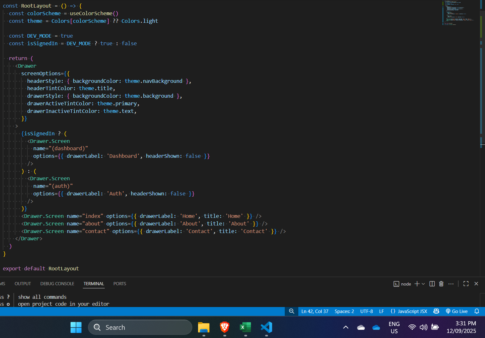

# RN Navigation

- Research the different types of navigation in React Native (Stack, Tab,
  Drawer)

- Types of navigation in React Native (with React Navigation):
  - Stack Navigator: Works like a call stack. Each new screen is pushed on top,
    and going back pops it off. Common for workflows like login flows or reading
    articles.  

  - Tab Navigator: Provides a tab bar (usually bottom) to switch between
    different sections of the app. Common for main app areas like Home, Profile,
    or Settings.  

  - Drawer Navigator: Provides a side menu (drawer) to switch between screens.
    Common in apps with many sections, like Gmail.
     

- Implement basic navigation between screens using React Navigation

- I have implemented all three navigation methods as shown above.

- Explore deep linking and how navigation state is managed

- Deep linking lets you open specific screens in your app via URLs. In React
  Navigation (and expo-router), deep links map URLs to navigation states. The
  navigation state is managed internally by React Navigation, tracking the
  current route, stack, and parameters. When a deep link is triggered, React
  Navigation parses the URL and updates the navigation state to show the correct
  screen.

- Understand how navigation props work in function components

- In Expo, when I use React Navigation, each screen component automatically
  receives navigation and route props. The navigation prop lets me move between
  screens, go back, replace screens, or update options like the header title.
  The route prop contains the current route’s name and any parameters passed via
  navigation. In function components, I often use the hooks useNavigation() and
  useRoute() instead of relying on props. This is especially useful for deeply
  nested components, because I can access navigation and route information
  anywhere without prop drilling.

- What are the key differences between stack, tab, and drawer navigation?
  - Stack: Screens are pushed onto a stack and popped when going back. Best for
    workflows, login flows, or sequential steps.

  - Tab: Screens are shown as tabs, usually at the bottom. Great for main
    sections users switch between frequently, like Home, Profile, and Settings.

  - Drawer: Screens are accessed via a side menu (drawer). Useful for apps with
    many sections or settings, like email apps.

- In Expo, I can combine these navigators, for example, a drawer containing
  tabs, each tab containing a stack.

- How does React Navigation handle screen transitions?

- Expo uses React Navigation’s default platform animations. Stack navigation
  slides screens from the right on iOS and usually slides up or fades on
  Android. Tabs fade or slide between screens, and drawers slide in/out. I can
  customize animations using screenOptions or transitionSpec. React Navigation
  manages screen mounting: inactive screens stay mounted by default but can be
  unmounted when unfocused for memory optimization. This ensures smooth
  transitions and proper lifecycle handling.

- How would you implement deep linking in a React Native app?

- In Expo, deep linking is easier than in plain React Native. I would define a
  linking configuration in NavigationContainer, mapping URL patterns to screens
  and passing dynamic parameters. For example, “profile/:id” allows a link like
  myapp://profile/123 to open the Profile screen with route.params.id = 123. I
  then define a scheme in app.json under expo.scheme (e.g., "myapp"). Expo
  automatically handles incoming links on both Android and iOS, so I don’t need
  to manually edit AndroidManifest.xml or Xcode. React Navigation listens for
  links, parses them, and navigates to the correct screen. I would then test
  links from browsers, emails, or other apps to ensure everything works.
