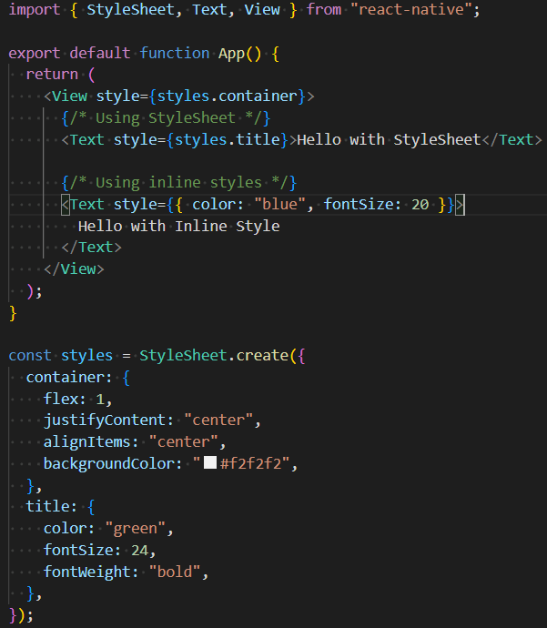
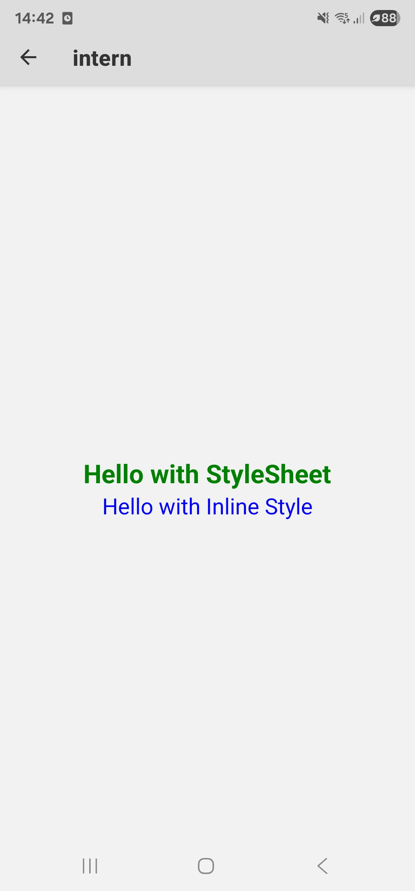
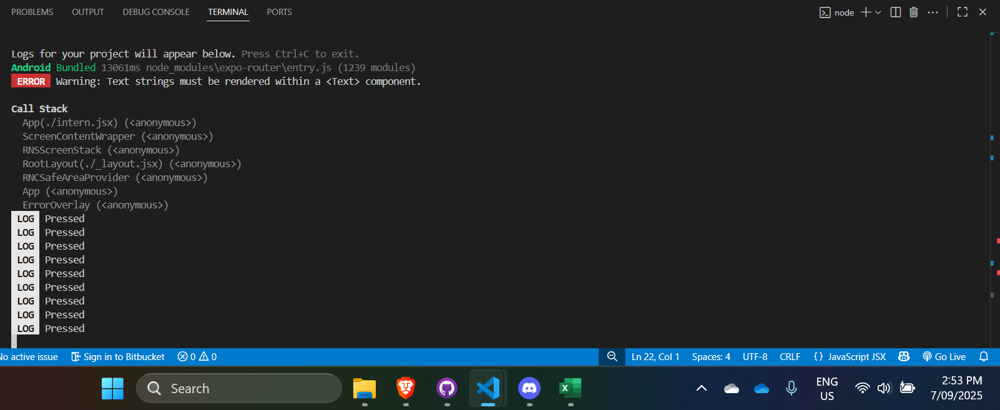
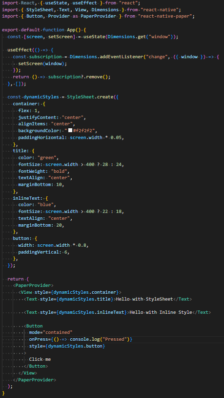

# RN Styling

- Research the differences between React Native Stylesheets and standard CSS
  - React Native styling is inspired by CSS but it isn’t the same thing.
    - Definition method:
      - CSS is declared in .css files or < style > blocks, then applied via
        class selectors.\
      - React Native Styles are JavaScript objects, defined inline or through
        StyleSheet.create().\

    - Cascading and inheritance:
      - CSS uses the cascading styles that can “flow down” from parent elements
        or global stylesheets, and selectors can target multiple elements.
      - React Native doesn’t cascade, every component’s style must be applied
        explicitly and parent styles don’t automatically apply to children.

    - Selectors and pseudo-classes:
      - CSS supports advanced selectors (.container > p, #id, :hover,
        :nth-child).
      - React Native has none of these but instead you control styles
        dynamically with conditional rendering in JavaScript.

    - Properties and units:
      - React Native supports a subset of CSS properties, mostly related to
        layout, text, and positioning. Properties like boxShadow or
        backgroundColor are supported, but things like float, z-index quirks, or
        grid layouts are not.
      - React Native uses unitless numbers for sizes — fontSize: 16 means 16
        density-independent pixels (dp). In CSS, you might use px, %, em, etc.

    - Layout model:
      - React Native uses Flexbox everywhere for layouts, and the default
        direction is column.
      - CSS Flexbox defaults to row direction.

- Experiment with both StyleSheet.create() and inline styles

- Explore how styling frameworks like @rneui/themed or react-native-paper work

Styling frameworks like @rneui/themed and react-native-paper simplify React
Native development by providing pre-built, customizable components that follow
consistent design patterns across iOS and Android. Instead of manually styling
everything, developers can use ready-made elements such as buttons, cards, and
dialogs that automatically adapt to themes, colors, and typography. These
frameworks include built-in support for light and dark modes, accessibility, and
cross-platform consistency, which helps save time, reduce repetitive styling,
and ensure a polished, professional look. While react-native-paper follows
Google’s Material Design system, @rneui/themed offers a more flexible,
theme-driven approach suitable for various design styles.

- Test responsiveness using built-in React Native utilities

- Why does React Native use camelCase instead of traditional CSS properties?

- React Native uses camelCase for style properties because its styles are
  defined as JavaScript objects rather than CSS strings. In JavaScript, object
  keys with hyphens (like background-color) aren’t valid identifiers unless you
  quote them, which would be cumbersome and error-prone. For example, you’d have
  to write {"background-color": "red"} instead of the cleaner backgroundColor:
  "red". Using camelCase ensures that property names are valid JavaScript
  identifiers, consistent with the language’s conventions, and easy to reference
  programmatically. Additionally, it aligns with how inline styles work in React
  for the web (style= {{ backgroundColor: 'red' }}), making the API more uniform
  across platforms and avoiding the need for string parsing or conversion.

- What are the benefits of using StyleSheet.create() over inline styles?
  - Performance: Styles defined with StyleSheet.create() are compiled once and
    assigned an internal ID, which the React Native bridge can reference
    efficiently. Inline styles, on the other hand, create a new object on every
    render, which can lead to unnecessary re-renders and reduced performance.
  - Validation: StyleSheet.create() validates property names and values at
    runtime. If you mistype a style property (e.g., backgrounColor), React
    Native will warn you, helping catch errors early. Inline styles do not
    provide this validation.
  - Reusability and Maintainability: Styles can be defined once and applied to
    multiple components, making your code cleaner and easier to maintain. Inline
    styles require repeating the same style objects in multiple places, which
    can become messy.
  - Consistency: Centralizing your styles promotes a consistent design
    throughout the app. You can easily update a single style in the StyleSheet,
    and it propagates wherever that style is used.
  - Separation of concerns: Using StyleSheet.create() separates layout and
    styling from component logic, improving readability and making it easier for
    teams to manage large codebases.

- How would you handle different screen sizes in React Native?
  - Flexbox layouts: React Native relies on Flexbox for layout, which allows
    components to automatically adjust their size and position based on the
    available space. Using properties like flex, justifyContent, and alignItems
    ensures that elements scale naturally across screen sizes.
  - Percentage-based dimensions: Instead of using fixed pixel values, define
    widths, heights, and margins using percentages. For example, width: "80%"
    allows a component to occupy 80% of the available screen width, making it
    flexible across devices.
  - Dimensions API: Use Dimensions.get("window") to get the device’s current
    width and height. You can then apply conditional styles based on screen size
    or orientation. For example, you might increase font size or padding on
    larger screens.
  - Platform-specific adjustments: Use the Platform module to apply styles
    differently for iOS vs Android if needed, accounting for variations in
    default spacing or UI conventions.
  - Safe areas – Consider using react-native-safe-area-context to handle
    notches, status bars, and rounded corners, ensuring that content isn’t
    clipped on modern devices.
  - Responsive libraries (optional): Libraries like
    react-native-responsive-dimensions, react-native-size-matters, or
    react-native-responsive-fontsize provide helper functions to scale font
    sizes, margins, and component sizes proportionally across screens.
  - Orientation handling: Listen for dimension changes using
    Dimensions.addEventListener("change") to adapt your layout when the device
    rotates between portrait and landscape.
