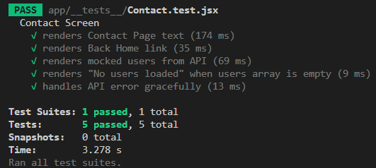

# RN Testing

- Research the difference between unit, integration, and end-to-end testing

- The difference between unit, integration, and end-to-end testing lies in their
  scope and purpose. Unit tests focus on the smallest building blocks of an
  application, such as a function, hook, or a single component, and check
  whether they behave as expected in isolation. For example, you might test that
  a date formatting utility always returns the correct string. Integration tests
  step up in complexity by verifying how different pieces of the application
  work together. In React Native, this could mean rendering a form that depends
  on validation logic and ensuring that when a user enters invalid data, the
  error messages appear correctly. End-to-end (E2E) tests, on the other hand,
  simulate the experience of a real user by testing the full flow of the app on
  a device or emulator. With tools like Detox, developers can automate actions
  such as logging in, navigating through screens, and checking whether data is
  correctly displayed. Together, these levels of testing build confidence at
  different layers of the application.

- Why is testing important in React Native development?

- Testing is especially important in React Native development because mobile
  apps are highly interactive and run on many different devices and operating
  systems. Without tests, small bugs can quickly grow into major issues for end
  users, leading to crashes, broken features, or poor performance. Testing also
  gives developers confidence to refactor code or add new features without
  worrying about breaking existing functionality. In collaborative teams, it
  ensures that everyone can work safely in the same codebase. Ultimately,
  thorough testing reduces manual testing effort, speeds up development, and
  improves the reliability of the final app.

- How do you mock API calls in tests?

- Mocking API calls in tests is a common practice because real network requests
  are slow, unpredictable, and make tests dependent on external services. In
  React Native, you can mock API calls using tools like Jest’s jest.mock or
  jest.spyOn to replace the actual function with a fake one. For example,
  instead of calling a live API to fetch users, you can mock the function to
  return a predefined array of user objects. This way, your component tests
  remain fast, reliable, and focused on whether the UI behaves correctly when
  data is available, missing, or when an error occurs. Mocking also allows you
  to simulate error states easily, which would be difficult to reproduce with a
  real API.

- What’s the difference between unit and integration tests?

- The difference between unit and integration tests lies mainly in scope and
  dependencies. A unit test isolates a single function or component and verifies
  that it works correctly without considering its connections to other parts of
  the system. It is fast, simple, and usually covers many small cases. An
  integration test, however, combines two or more units and checks that they
  interact correctly. For instance, you might test a list component that renders
  data from an API hook—this requires both the hook and the component to work
  together. Unit tests help pinpoint bugs quickly, while integration tests
  provide assurance that the system behaves as expected when parts are combined.
  Both are necessary to build a robust React Native app.

- Code Snippet of the Test:

```javascript
import { render } from '@testing-library/react-native';
import { SafeAreaProvider } from 'react-native-safe-area-context';
import Contact from '../contact';
import * as api from '../../constants/api';

// ----------------------
// Mocks
// ----------------------
jest.mock('react-native-safe-area-context', () => ({
  SafeAreaProvider: ({ children }) => children,
  useSafeAreaInsets: () => ({ top: 0, right: 0, bottom: 0, left: 0 }),
}));

jest.mock('react-native/Libraries/Utilities/useColorScheme', () => ({
  __esModule: true,
  default: jest.fn(() => 'light'),
}));

jest.mock('../../constants/Colors', () => ({
  Colors: {
    primary: '#6849a7',
    warning: '#cc475a',
    dark: {
      text: '#d4d4d4',
      title: '#fff',
      background: '#252231',
      navBackground: '#201e2b',
      iconColor: '#9591a5',
      iconColorFocused: '#fff',
      uiBackground: '#2f2b3d',
    },
    light: {
      text: '#625f72',
      title: '#201e2b',
      background: '#e0dee9',
      navBackground: '#e8e7ef',
      iconColor: '#686477',
      iconColorFocused: '#201e2b',
      uiBackground: '#d6d5e1',
    },
  },
}));

// ✅ Fix: require inside the mock
jest.mock('expo-router', () => {
  const { TouchableOpacity } = import('react-native');
  return {
    Link: ({ children, style, ...props }) => (
      <TouchableOpacity style={style} {...props}>
        {children}
      </TouchableOpacity>
    ),
  };
});

jest.spyOn(api, 'getUsers').mockResolvedValue([
  { id: 1, name: 'Mocked User 1' },
  { id: 2, name: 'Mocked User 2' },
  { id: 3, name: 'Mocked User 3' },
]);

// ----------------------
// Custom render helper
// ----------------------
function renderWithProviders(ui) {
  return render(<SafeAreaProvider>{ui}</SafeAreaProvider>);
}

// ----------------------
// Tests
// ----------------------
describe('Contact Screen', () => {
  beforeEach(() => {
    jest.clearAllMocks();
  });

  it('renders Contact Page text', () => {
    const { getByText } = renderWithProviders(<Contact />);
    expect(getByText('Contact Page')).toBeTruthy();
  });

  it('renders Back Home link', () => {
    const { getByText } = renderWithProviders(<Contact />);
    expect(getByText('Back Home')).toBeTruthy();
  });

  it('renders mocked users from API', async () => {
    const { findByText } = renderWithProviders(<Contact />);
    expect(await findByText('Mocked User 1')).toBeTruthy();
    expect(await findByText('Mocked User 2')).toBeTruthy();
    expect(await findByText('Mocked User 3')).toBeTruthy();
  });

  it('renders "No users loaded" when users array is empty', async () => {
    jest.spyOn(api, 'getUsers').mockResolvedValueOnce([]);

    const { findByText } = renderWithProviders(<Contact />);
    expect(await findByText('No users loaded')).toBeTruthy();
  });

  it('handles API error gracefully', async () => {
    const consoleSpy = jest
      .spyOn(console, 'error')
      .mockImplementation(() => {});
    jest.spyOn(api, 'getUsers').mockRejectedValueOnce(new Error('API Error'));

    const { findByText } = renderWithProviders(<Contact />);
    expect(await findByText('No users loaded')).toBeTruthy();

    expect(consoleSpy).toHaveBeenCalledWith(
      'Failed to fetch users:',
      expect.any(Error)
    );
    consoleSpy.mockRestore();
  });
});
```

- Output: 

- Issues Faced: When I was working on tests for the Contact screen, I ran into
  an unexpected problem with mocking one of the navigation components. At first
  everything looked fine, but when I ran the test suite, Jest kept throwing
  confusing errors about invalid components and experimental modules. I tried a
  couple of fixes that seemed logical, but each time I got a new error that
  looked even stranger than the last.

The interesting part was realizing the issue wasn’t with my component at all—it
was how Jest handles mocked dependencies. I learned that Jest is very strict
about what you can and can’t reference inside a mock. What finally solved the
problem was restructuring the mock so that everything it needed was defined
directly inside the mock itself.

It felt like a small breakthrough, because once I understood the rule, the
errors suddenly made sense. It was a reminder that sometimes the hardest part of
testing isn’t the component you’re testing, but figuring out how the testing
framework expects you to “pretend” things work.
