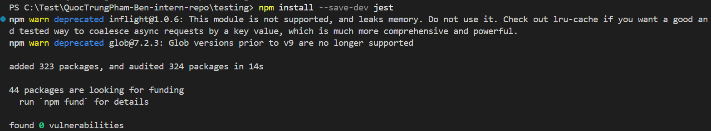
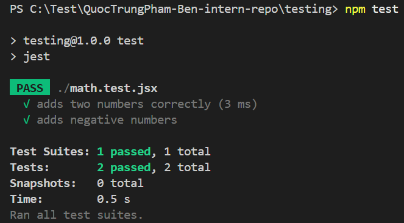
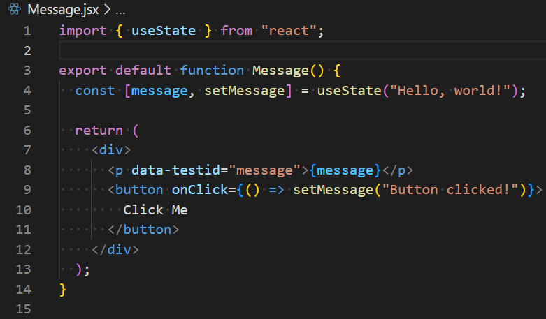
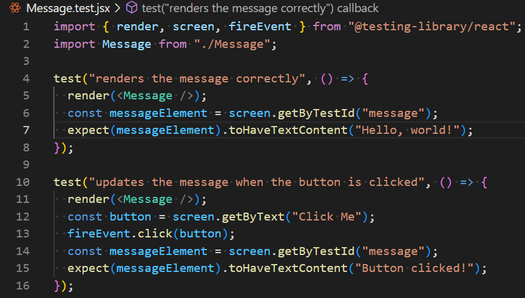
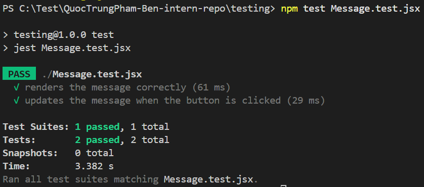

# Unit Testing

📌 Introduction to Unit Testing with Jest

- Research what Jest is and why unit tests are important

- Jest is a JavaScript testing framework created by Meta that provides tools for
  writing and running tests, especially for React applications but also for
  general JavaScript and Node.js projects. It is popular because it includes
  features like test runners, mocking, and code coverage out of the box, making
  it easy to set up and use. Unit tests are important because they check
  individual parts of a program in isolation, ensuring that each function or
  component works correctly. This improves reliability, helps prevent bugs when
  making changes, and makes the codebase easier to maintain.

- I have completed setting up Jest in my React project, ensuring it was properly
  configured. I then wrote a simple test for a utility function, and ran the
  test to confirm that it passed successfully. After verifying the results, I
  pushed the test to GitHub to keep it version-controlled and available for
  collaboration.

- Why is automated testing important in software development?

- Automated testing is important because it reduces manual effort and human
  error by running tests quickly and consistently. It enables developers to
  validate code frequently, which is crucial for continuous integration and
  delivery pipelines. Automated tests improve development speed, maintain
  software quality at scale, and provide confidence when adding new features or
  refactoring existing code.

- What did you find challenging when writing your first Jest test?

- The main challenge when writing a first Jest test is shifting from writing
  functional code to thinking about how to test that code. It can be difficult
  to decide what parts of the program to test and how to structure the tests.
  Learning Jest’s matchers, handling mocks, and setting up the testing
  environment can also feel unfamiliar at first.

📌 Testing React Components with Jest & React Testing Library

- Research how React Testing Library works with Jest.

- React Testing Library is designed to work hand-in-hand with Jest, which
  provides the test runner, assertion utilities, and mocking capabilities. While
  Jest sets up the test environment and runs test files, React Testing Library
  focuses on rendering React components in a simulated DOM provided by jsdom.
  This allows tests to run as if they were in a browser, without needing a real
  one. Together, Jest handles the testing framework aspects (e.g., describe, it,
  expect), while React Testing Library provides utilities (render, screen,
  fireEvent, and userEvent) to interact with components in a way that mirrors
  actual user behavior.

- What are the benefits of using React Testing Library instead of testing
  implementation details?

- The key advantage of React Testing Library is that it encourages testing from
  the user’s perspective rather than the developer’s. Instead of asserting
  internal state or component methods, tests interact with the DOM elements the
  same way a user would by looking for text, labels, roles, or placeholders.
  This leads to more resilient and meaningful tests that are less likely to
  break during refactoring, since they don’t rely on the inner workings of a
  component. The result is tests that validate actual behavior and user
  experience, ensuring confidence that the application works as intended.

- What challenges did you encounter when simulating user interaction?

- One common challenge when simulating user interactions is ensuring that the
  test environment behaves like a browser. For example, without configuring
  jsdom, operations such as clicking a button or typing into an input will fail
  because there is no document object. Another difficulty is dealing with
  asynchronous updates, such as state changes or API calls triggered by user
  events, which may require await and utilities like waitFor to avoid false
  negatives. Additionally, matchers like toHaveTextContent require extra setup
  with @testing-library/jest-dom. These challenges highlight the importance of
  correctly setting up the testing environment and learning the proper utilities
  for simulating realistic user behavior.
